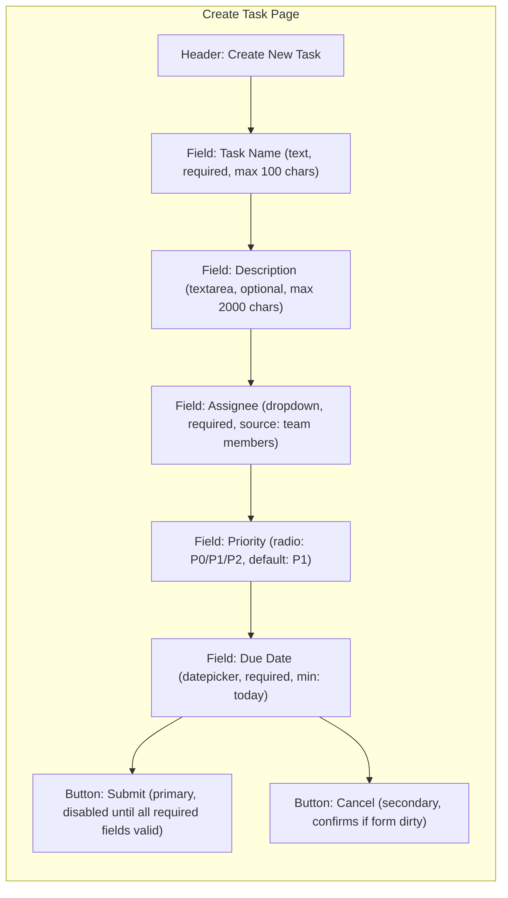

# PRD Document

## 0. Relationship to Parent

This Skill inherits **all** constraints from `doc-writing-guide`:

- Intent interpretation (SS1): purpose, audience, tone, scope, and constraint analysis.
- Genre & format selection (SS2): PRD maps to the "Product Requirements" genre row.
- Language to avoid (SS3): no checklist-jargon, no empty superlatives, no formulaic stubs.
- Content structure principles (SS4): substance over format, no pre-imposed rigid outlines.
- Visual generation guide (SS5): charts and diagrams follow parent rules.
- Citation: PRD is an internal product document — do NOT add inline citations or a Sources/References section unless the user explicitly requests competitive research that involves web retrieval.

Anything defined below **extends** the parent; it never overrides.

### Default Artifact Format

**The default output artifact for a PRD is the `html-report` skill** (self-contained HTML report). This Skill focuses on **content generation** (structure, depth, quality); the `html-report` skill handles **artifact production** (theme, layout, charts, HTML rendering).

- If the user does **not** specify an output format → use the `html-report` skill to produce the final deliverable.
- **Only** if the user explicitly requests `.docx` or `.pdf` → route to the corresponding format skill instead.
- Vague phrasing like "write a PRD", "help me draft product requirements" → default to `html-report` skill.

---

## 1. Core Principles

1. **Dynamic, not template-filling.** PRD depth, structure, and expression are determined by product stage, business scenario, industry constraints, organization style, and engineering concerns — never by a single fixed template.
2. **Proactive elicitation over fabrication.** When information is insufficient, ask — do not invent data, users, competitors, or timelines.
3. **Engineering executability first.** The PRD must enable engineers to proceed directly to implementation without additional clarification. Every page, field, state, and edge case must be specified. Boundaries explicit, logic closed-loop, acceptance criteria testable, risk controllable. A PRD that leaves engineers uncertain about what to build is incomplete.
4. **When words cannot clarify, use diagrams.** Any product interaction, page layout, state transition, or data flow that cannot be unambiguously conveyed through text alone requires a diagram — either drawn via Mermaid/PlantUML or generated via `generateImage` tool. Criterion: if the written description admits multiple visual interpretations, a diagram is mandatory.

---

## 2. Workflow Overview

Execute the following steps in order:

```
Step 1: Requirement Recognition → classify the request across 5 dimensions
Step 2: Information Completeness Scoring → score 9 dimensions, identify gaps
Step 3: Targeted Elicitation → ask critical questions (max 2 rounds)
Step 4: Scenario Routing → select depth, mandatory modules, emphasis
Step 5: PRD Generation → produce modular PRD with scene-adaptive structure
Step 6: Quality Self-Check → verify 14 items, annotate gaps
```

---

## 3. Requirement Recognition (Five Dimensions)

On receiving a PRD request, classify the input across these five dimensions before proceeding:

| Dimension | Classification Options |
|-----------|----------------------|
| **Requirement type** | 0-to-1 product / New module / Small feature iteration / AI product / Hardware product / Fintech-compliance product / Enterprise SaaS / Government project |
| **Complexity** | Lightweight (1–3 pages) / Medium (5–15 pages) / Heavyweight (20+ pages) |
| **Audience** | Engineering / Management / Customer / Review board / QA / Algorithm team |
| **Industry** | Internet / Fintech / Hardware / SaaS / Government / Healthcare / Other |
| **Risk level** | Low (UX polish) / Medium (core flow change) / High (compliance / security / AI accuracy / customer commitment) |

**Execution rule:** Present classification as a brief table to the user. Confirm correctness before proceeding. If uncertain about any dimension, state your inference rationale and ask the user to confirm or correct.

---


## 5. Scenario Routing Matrix

Select PRD depth and mandatory modules based on scenario type:

| Scenario | Default Depth | Mandatory Modules | Emphasis | Key Risks |
|----------|--------------|-------------------|----------|-----------|
| **0-to-1 product** | Heavyweight | Market opportunity, user validation, competitive analysis, product positioning, MVP scope, architecture, roadmap, team & timeline, metrics | Why build, what first, how to validate | Scope creep, unvalidated assumptions, over-investment |
| **AI product** | Medium–Heavy | Task definition, I/O spec, accuracy metrics, evaluation methods, go/no-go criteria, fallback mechanisms, compliance | How to judge quality, error tolerance | Hallucination, unstable accuracy, insufficient evaluation, over-trust |
| **Small iteration** | Light–Medium | Current state & problem, change scope, rules, impact analysis, acceptance criteria | Fast disambiguation, strong acceptance | Missed impact, unclear acceptance, regression |
| **Fintech / compliance** | Heavyweight | Regulatory basis, permission system, risk-control rules, audit logs, exception compensation, acceptance with audit trail | Compliance + audit + security | Regulatory risk, permission breach, audit gap |
| **Hardware product** | Heavyweight | Hardware specs, firmware capabilities, device state management, production testing, after-sales plan | Spec freeze + mass-production feasibility | Spec change cost, irreversible production, compatibility |
| **Enterprise SaaS** | Medium–Heavy | Role permissions, tenant isolation, configurability, integrations, data migration, SLA | Configurable + deliverable | Permission complexity, delivery variance, insufficient configurability |
| **Government project** | Heavyweight | Policy background, construction objectives, construction scope, organizational division, implementation plan, acceptance criteria, O&M assurance | Formal + auditable + reportable | Scope disputes, acceptance ambiguity, handover risk |

**Routing rule:** Match the user's scenario to the closest row. If multiple rows apply (e.g., "AI + SaaS"), merge mandatory modules from both rows.

---

## 6. PRD Modular Template

Generate the PRD using these modules. **Select, expand, or omit modules based on the scenario routing result** — do not blindly include everything.

> **Default depth is Medium.** Unless the scenario clearly matches Lightweight or Heavyweight criteria, generate at Medium depth.

> **Plain language (inherited from parent, reinforced here):** All PRD prose must use plain, everyday wording that any team member can understand on first read. Avoid consultant jargon, self-invented abstractions, and unnecessarily formal phrasing (e.g., ❌ "赋能"、"抓手"、"闭环"、"显式标注"、"触达"、"心智"). When a simpler word exists, use it.

### 6.0 Depth & Module Map

| Module | Lightweight | Medium (default) | Heavyweight |
|--------|-------------|-------------------|-------------|
| **Meta Info (version/status/history)** | Minimal (title + date only) | Minimal (title + date only) | Required |
| **Requirement Background** | Required (brief) | Required | Required (full) |
| **Objectives** | Required (may merge with Background) | Required | Required |
| **Competitive/Market/User Research** | Omit | Required (focus on competitive, with web search) | Required (full four-dimension) |
| **Functional Requirements (prototype + table)** | Required | Required | Required |
| **Timeline** | by case | Required | Required (with staffing) |
| **Data & Metrics** | by case | by case | Required |
| **Ops Planning** | by case | by case | by case |
| **Iteration Plan** | Omit | by case | Required (full roadmap) |
| **Acceptance Criteria** | by case | by case | Required |

**Typical length:** Lightweight 1–5 pages | Medium 5–10 pages | Heavyweight 10+ pages

**Section count cap:** Lightweight ≤ 5 sections | Medium ≤ 8 sections | Heavyweight no hard limit (use as needed for complex requirements).

**Meta Info rule:** For Lightweight and Medium PRDs, omit the full meta-info block (version table, status, change history). Only retain document title + creation date at the top. For Heavyweight PRDs, include the complete meta-info section (version, owner, reviewers, status, change log).

**By-case trigger rules:**

- **Data & Metrics**: Required when core business metrics change OR AB experiment validation is needed.
- **Ops Planning**: Required when cold-start, user operations, or content operations strategy is involved.
- **Acceptance Criteria**: Required when high-risk flows (financial/security/compliance) or cross-team collaboration is involved.

> **Acceptance Criteria** is used internally as a go/no-go quality gate (see §9) to verify the PRD meets delivery standards before finalization.

### 6.1 Core Modules (always present)

#### Module 1: Requirement Background

- Business background and trigger source
- User current state and pain points
- Consequence of not solving
- Evidence strength annotation: `[Data-backed]` / `[Research-backed]` / `[Expert judgment]` / `[PM hypothesis]` — never present a hypothesis as fact

#### Module 2: Functional Requirements (with Prototype)

> ⚠️ **This is the PRD's core chapter.** Functional requirements must be exhaustive, visual, and engineer-actionable. Every feature module must pair a **prototype** with a **feature description**. The prototype is NOT a separate chapter — it lives inside this module.

##### 2.1 Structure: Overview Table + Module Detail (both required)

Functional requirements must include **two complementary parts**:

1. **Feature Overview Table** — A full enumeration of all feature points, providing a quick index for engineers and reviewers.
2. **Module Detail with Prototype** — Per-page/module deep description paired with inline prototype diagrams.

These are not alternatives — both are mandatory. The table gives the "what" at a glance; the module detail gives the "how" with visual proof.

---

**Part 1: Feature Overview Table**

| # | Module | Functional Description |
|---|--------|----------------------|
| 1 | Page/module name | Complete description of the feature: what it does, how users interact with it, key business rules, and constraints. Must be detailed enough to guide implementation. |

- Enumerate **every** feature point across all pages/modules.
- The "Functional Description" column must be **substantive and implementation-guiding** — not a one-line summary. Include business logic, interaction flow, and critical rules in a single cohesive paragraph.
- Feature numbers (#) are referenced in Part 2 and in prototype annotations.

---

**Part 2: Module Detail with Prototype**

Organize by page/module using headings. Each module section must include:

1. **Prototype diagram** (inline) — see §2.2 for generation strategy
2. **Functional description** per feature — written against the following dimensions (priority order):

  | Priority | Dimension | When to include | Content |
  |----------|-----------|-----------------|---------|
  | **P0** | Business logic | Always | Trigger conditions, processing rules, output results |
  | **P0** | Interaction logic | Always | User action → system response → page change |
  | **P1** | Rule constraints | When feature has complex validation | Field name/type/length/required/validation rules; state flow conditions (current state → allowed operations → next state) |
  | **P2** | Permission logic | When multi-role access differs | Role-based visibility, operation scope, data isolation |
  | **P2** | Boundary & exception | When failure modes are non-obvious | Network timeout/retry; concurrency conflict; empty data display; insufficient permission prompt |

  **Example** (an e-commerce order module):
  > - **Business logic**: User submits order → system freezes corresponding amount → status changes to "Pending Shipment" → seller ships → buyer confirms receipt → release escrowed funds.
  > - **Interaction logic**: Click "Confirm Receipt" → modal for secondary confirmation → confirm: release funds + redirect to review page; cancel: close modal, no state change.
  > - **Rule constraints**: Product title: text, 2–30 chars, required, no pure symbols; only "Pending Receipt" status allows "Confirm Receipt" and "Request Refund" operations.
  > - **Permission logic**: Admin can view all orders; buyer can only view own orders; seller can view orders related to own store.

3. **Notes** (optional): Exception scenarios, design intent, deferred items.

> **Text-prototype correspondence**: Every text description in the "Functional Description" must correspond to a specific area/component in the prototype. If a prototype has labeled zones (A, B, C...), reference them explicitly. Feature numbers from Part 1 must appear as annotations on the prototype.

##### 2.2 Prototype Generation (within Functional Requirements)

Every core page or screen must have a **prototype illustration** showing layout, information hierarchy, and element positioning. Prototypes are part of the Functional Requirements module — not a separate chapter.

> **Universal rule:** Any interaction or product concept that **cannot be unambiguously conveyed in text** must have an accompanying diagram — regardless of whether it maps to a "page". This includes complex state transitions, multi-role handoff flows, conditional UI variations, and spatial relationships between components.

**For HTML output format**, prototypes are not limited to static wireframes:

- **Visual fidelity**: Implement near-real page layouts and visual effects, not just wireframes.
- **Simple interactions**: Include Tab switching, modal popups, state toggles, hover effects — reducing the need for multiple screenshots to explain one interaction.
- **Inline embedding**: Prototype components are embedded directly in the Feature Overview Table rows, maintaining one-to-one correspondence with feature descriptions.

**Generation strategy** (select by content type):

1. **Mermaid / PlantUML** — Best for relational/logical structures:
   - Flow charts, state machines, decision trees
   - Sequence diagrams (multi-system interaction)
   - Architecture diagrams (component relationships)
   - Navigation structures (route maps)

2. **HTML/CSS inline prototype** — Best for high-fidelity UI layout (when PRD output is HTML):
   - Near-real page layouts with cards, forms, lists, navigation
   - Typography, spacing, color, and visual hierarchy
   - Simple interactions (tab switching, modal, hover, state toggles)
   - Embeds directly in the document — prototype IS part of the deliverable

3. **`generateImage` tool (AI image generation)** — Best for visual/aesthetic content:
   - Complex spatial relationships that text cannot represent
   - Rich visual components (dashboards, data visualizations, drag-and-drop)
   - Look-and-feel that requires illustration-level detail
   - Multi-panel layouts with overlapping layers or non-linear arrangements

**Prototype content must include:**

- Page title and navigation context (where does the user arrive from?)
- All functional areas with labeled boundaries
- Field placements with annotations (name, type, constraints)
- Primary action buttons with state (enabled/disabled/loading)
- Secondary actions and their visibility conditions
- Empty states, loading states, and error states (at least as annotations)
- Responsive behavior notes (if applicable)

**Example — Mermaid wireframe for a form page:**



#### Module 3: Users & Scenarios

- Target user personas (with proficiency, frequency, decision authority, pain severity)
- Role separation: user / buyer / approver / admin / operator / support / developer may be different people
- Core scenarios with priority ranking
- Preconditions for usage
- For B2B / fintech / hardware / AI platform products, role decomposition is typically more important than for consumer products


### 6.3 Scenario-Triggered Modules (include when routing matches)

#### Module 4: Data & Metrics *(Medium+ depth)*

- North-star or core metric
- Process metrics: exposure, click, conversion, submission, generation, pass, share, export, reuse, retention
- Quality metrics: success rate, error rate, latency, recall, precision, satisfaction, complaint rate, manual intervention rate
- Business metrics: revenue, cost, ARPU, renewal, leads, contract conversion, operational efficiency, ticket reduction
- Tracking requirements: event name, trigger timing, property fields, user segments, funnel definitions, dashboard needs
- Baseline and target values with observation period

> Distinguish "metrics" (what to observe) from "tracking" (how to collect). PRD must not just say "need tracking" — state what decision the tracking serves.

#### Module 5: Dependencies, Risks & Timeline *(Heavyweight depth)*

- Technical dependencies: backend APIs, data warehouse, model services, device SDK, third-party platforms, permission systems, payment systems
- Team dependencies: design, algorithm, frontend, backend, QA, ops, legal, support, sales, delivery
- External dependencies: vendors, channels, regulators, partners, customer environments, hardware production, app store reviews
- Risk list with probability, impact, and mitigation strategy (degradation plan, gradual rollout, manual fallback, rollback mechanism, delayed decision point)
- Milestones: requirement review, design review, technical review, development, integration, testing, gradual rollout, full launch, retrospective

### 6.4  Competitive Research Modules (include when scenario matches)

#### Competitive Research *(Medium+ depth)*

**Standard output structure:**

```
## Competitive Research

### Research Targets
| Competitor | Product Positioning | Target Users | Scale (commercialization/market/users) | Highlights |
|-----------|-------------------|-------------|---------------------------------------|------------|

### Feature Comparison Matrix (Heavyweight only)
| Dimension | Competitor A | Competitor B | Competitor C |
|-----------|-------------|-------------|-------------|
| Core feature 1 | ... | ... | ... |

### Research Conclusions
- Core flow comparison: operation steps / time cost / satisfaction
- Opportunities: capabilities competitors universally lack or do poorly
- Differentiation: our core advantage positioning
```

**Generation rules:**

- When using web search to gather competitor info, annotate data source and timeliness.
- Never fabricate competitor data. When information is insufficient, annotate `[To be supplemented - requires manual research]`.
- Recommend 2–4 competitors, no more than 5.
- Must include a **conclusions section** — never just list without analysis. Conclusions must contain actionable insights.

#### Market & Competitive Analysis *(0-to-1 products, extends Competitive Research)*

- Target market, user scale, growth trends, policy/tech window, entry timing
- Direct competitors, indirect competitors, adjacent platforms, manual/spreadsheet/outsourcing substitutes
- Product positioning: who we serve, who we don't, core differentiator, why we can win
- MVP scope: first-phase must-close core path; capabilities deferred; key hypothesis validation method
- Phase roadmap: MVP → Beta → GA → Scale

#### AI Accuracy & Evaluation *(AI products)*

- **Accuracy definition**: Task success criteria, quality dimensions (correctness, completeness, relevance, readability, format consistency, executability, safety, stability), subjective vs. objective metrics, per-scenario thresholds, error tolerance range
- **Evaluation system**:
  - *Offline evaluation*: Standard samples, boundary samples, negative samples, regression samples; scoring criteria (structure completeness, logic consistency, depth match, dev executability, acceptance testability, risk identification)
  - *Human review*: Reviewer roles, scoring dimensions, consistency mechanism, bad-case archival
  - *Online feedback*: Behavior metrics (edit rate, copy rate, export rate, share rate, re-ask rate, abandon rate), quality feedback (thumbs up/down, issue tags, human edit positions), efficiency metrics (time to usable output, PM revision time, engineering rejection count)
- **Go/no-go criteria**: Accuracy go, experience go, safety go, cost go, ops go
- **Fallback mechanisms**: Low-confidence prompting, human confirmation, retry, source citation, prohibition of auto-execution, rule-based fallback

#### Impact Analysis *(Small iterations)*

- Does this affect historical data? (field changes, display logic, metric definitions)
- Does this affect permissions? (different roles see different content, privilege escalation risk)
- Does this affect existing flows? (entry, navigation, notification, approval, export, search, filter)
- Does this affect analytics? (existing events still valid, new events need dashboard changes)
- Does this affect ops configuration? (back-office config, feature flags, copy config, experiment groups)

#### Compliance & Audit *(Fintech / regulated products)*

- Regulatory basis and compliance requirements
- Permission matrix (role × feature × data scope)
- Risk-control rules with trigger conditions
- Audit log requirements
- Data masking and encryption requirements
- Exception compensation and reconciliation
- User disclosure and consent requirements

#### Hardware Specifics *(Hardware products)*

- Hardware specifications, BOM constraints
- Firmware capabilities and version requirements
- Device state management and connectivity
- Environmental requirements (temperature, humidity, power consumption)
- Production testing and quality criteria
- After-sales and warranty flow

#### Multi-Tenant & Integration *(Enterprise SaaS)*

- Tenant isolation scheme
- Role-permission model (RBAC / ABAC)
- Configuration and customization capabilities
- Integration API inventory with customer systems
- Data migration and import/export
- SLA definitions and monitoring

---


## 9. Quality Self-Check

After generation, verify every item internally. If any item does not pass, revise the PRD content until it passes. Do NOT include the self-check table or results in the final deliverable — this checklist is for internal quality assurance only.

### 9.1 Four-Dimension Quality Scoring

Score the PRD holistically on these 4 dimensions (internal evaluation, not included in deliverable):

| Dimension | Evaluation Focus |
|-----------|-----------------|
| **Requirement Description Completeness** | Does the Feature Overview Table cover all features for every page? Are prototypes clear? Are feature descriptions readable and unambiguous for engineers? |
| **Depth Match** | Does the document depth match the requirement's complexity tier (§6.0)? Neither over-engineered nor under-specified? |
| **Prototype Expressiveness** | Do prototypes accurately convey interaction intent and page layout? For HTML output, do they include simple interactions where appropriate? |
| **Expression Adaptation** | Does the writing style match the target industry, organization type, and audience? |

### 9.2 Detailed Checklist (14 Items)

| # | Check Item | Pass Criteria |
|---|-----------|---------------|
| 1 | **Background is substantive** | Answers "why build this" with trigger source — not just "we need this" |
| 4 | **User personas are specific** | No instance of "all users" or similarly vague descriptors |
| 7 | **Functional module has depth** | Every P0/P1 feature has: Feature Overview Table row + interaction diagram + prototype diagram + feature detail table. No feature is described in only 1–2 sentences |
| 8 | **Prototype diagrams present** | Every core page/screen has a prototype (Mermaid/PlantUML/ASCII wireframe or generateimage). For HTML output, prototypes include simple interactions where appropriate |
| 10 | **Analytics tracking is purposeful** | Every tracked event states what decision it serves |
| 12 | **Depth matches complexity** | Lightweight requirement ≠ 20-page document; heavyweight requirement ≠ 2-page card |
| 13 | **Internal consistency** | Objectives, features, acceptance criteria, and metrics align with each other |
| 14 | **No hallucination** | No fabricated market data, competitor facts, timelines, resources, or org structures |

---

## 10. Red-Line Rules

1. **PRD describes "what", never "how."** Do not specify database types, programming languages, or framework choices.
2. **Prototype ≠ visual design.** PRD must include wireframe-level prototypes showing information architecture, field placement, and interaction logic. But do NOT specify visual design details (color schemes, font sizes, spacing, icon styles) — those belong to the design spec.
3. **Do not fabricate data.** Business data the user has not provided (DAU, conversion rates, market size, etc.) must be marked `[To be confirmed]`.
4. **Assumptions must be explicit.** Any content the AI infers or supplements must be annotated `[Assumption — to be confirmed]`.
5. **Do not omit roles.** Any feature involving multiple roles must document every role's perspective.

---

## 12. Related Skills

| Skill | Relationship |
|-------|-------------|
| `/comparison-analysis` | Before writing the PRD, run research-guide's reference competitive analysis to gather feature references |
