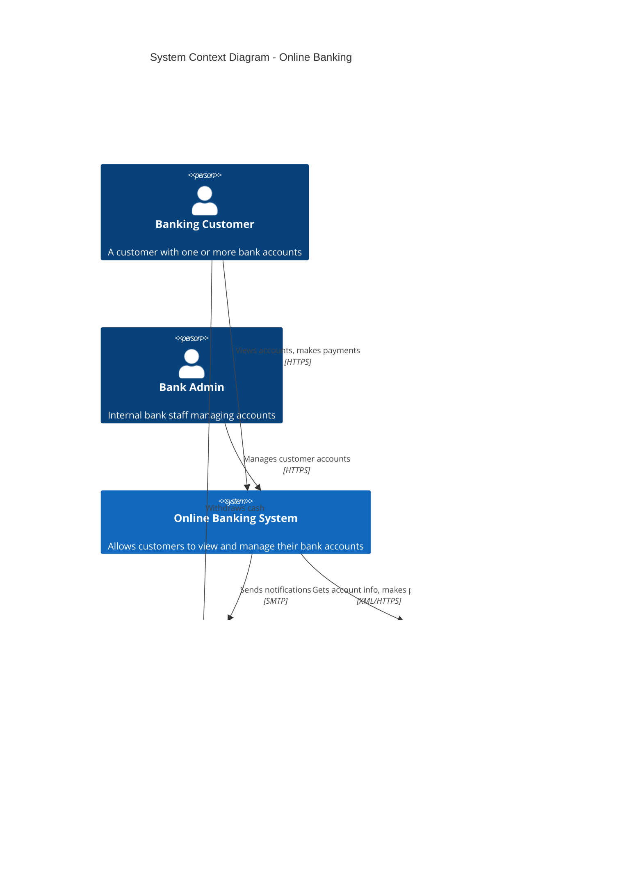
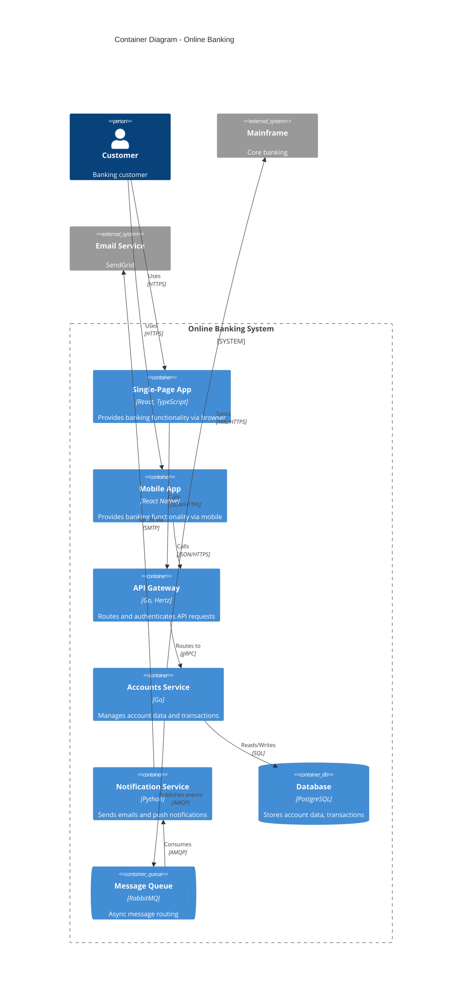
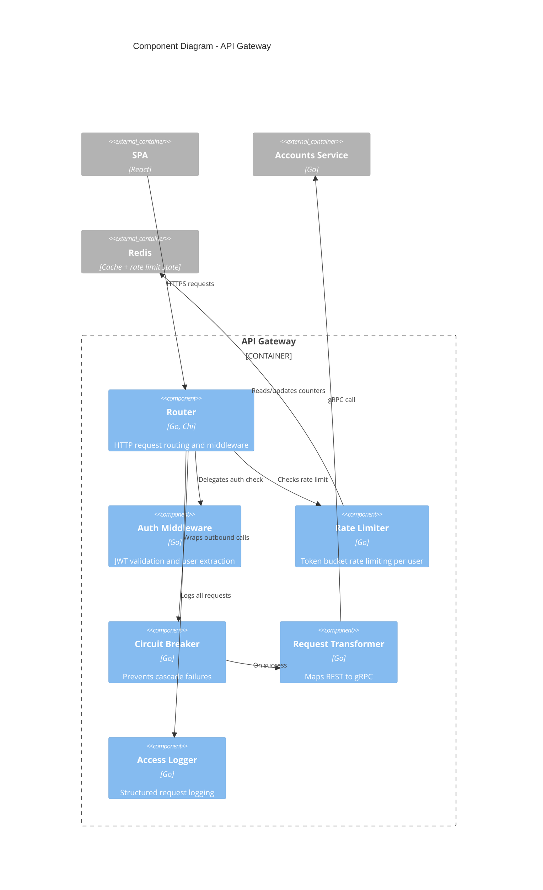
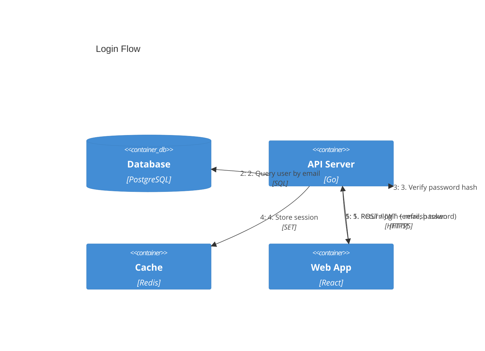

# C4 Diagram

Use for system architecture at different abstraction levels: Context (L1), Container (L2), Component (L3), and Dynamic views.

## Context Diagram (Level 1)

Shows the system in scope and its relationships with users and external systems.



## Container Diagram (Level 2)

Zooms into the system boundary, showing containers (applications, databases, etc.).



## Component Diagram (Level 3)

Zooms into a single container, showing internal components.



## Dynamic Diagram

Shows interactions for a specific scenario/use case.



## C4 Elements Reference

| Element | Syntax | Description |
|---------|--------|-------------|
| Person | `Person(id, "Name", "Desc")` | Human user |
| System | `System(id, "Name", "Desc")` | System in scope |
| External System | `System_Ext(id, "Name", "Desc")` | External system |
| Container | `Container(id, "Name", "Tech", "Desc")` | Application/service |
| Container DB | `ContainerDb(id, "Name", "Tech", "Desc")` | Database |
| Container Queue | `ContainerQueue(id, "Name", "Tech", "Desc")` | Message queue |
| Component | `Component(id, "Name", "Tech", "Desc")` | Internal component |
| Boundary | `System_Boundary(id, "Name") { }` | System boundary |
| Container Boundary | `Container_Boundary(id, "Name") { }` | Container boundary |
| Relationship | `Rel(from, to, "Label", "Tech")` | Directed relationship |
| Back Relationship | `BiRel(from, to, "Label", "Tech")` | Bidirectional |

## Styling

```
UpdateElementStyle(elementId, $fontColor="red", $bgColor="blue", $borderColor="black")
UpdateRelStyle(from, to, $textColor="blue", $lineColor="blue", $offsetX="10", $offsetY="-20")
UpdateLayoutConfig($c4ShapeInRow="3", $c4BoundaryInRow="1")
```

## Best Practices

1. **Start at Context (L1)** — always create context diagram first
2. **One diagram per level** — don't mix levels in the same diagram
3. **Clear boundaries** — use `System_Boundary` and `Container_Boundary`
4. **Label technology** — include tech stack in container/component descriptions
5. **Direction on relationships** — use verb phrases ("Calls", "Reads from", "Sends to")
6. **Include protocols** — show communication protocols (HTTPS, gRPC, AMQP, SQL)
7. **External systems** — always distinguish internal vs external with `_Ext` suffix
8. **Audience-appropriate** — Context for stakeholders, Container for architects, Component for developers
