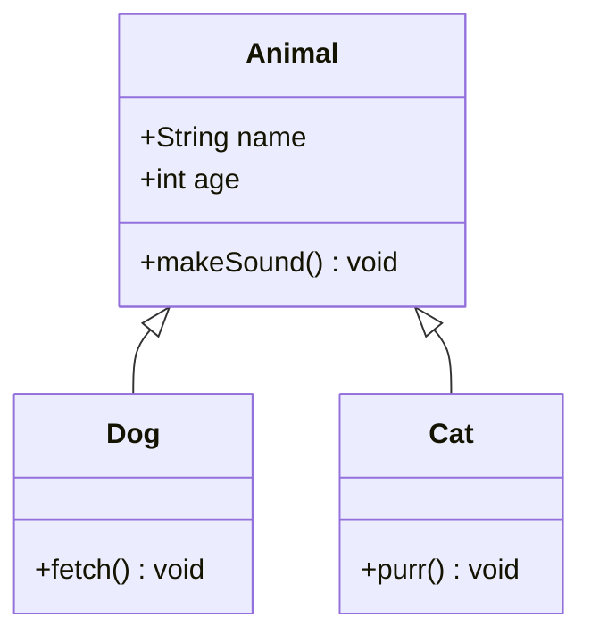
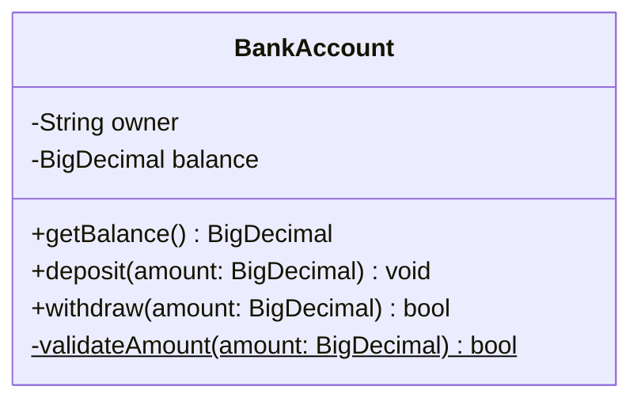
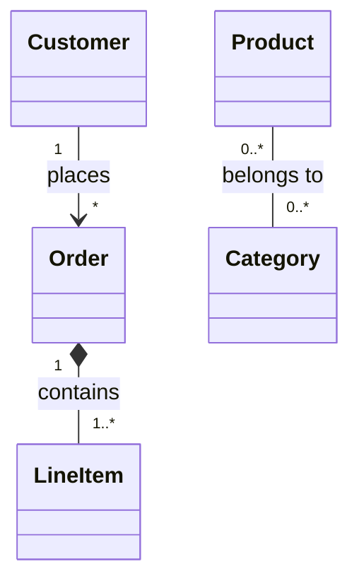
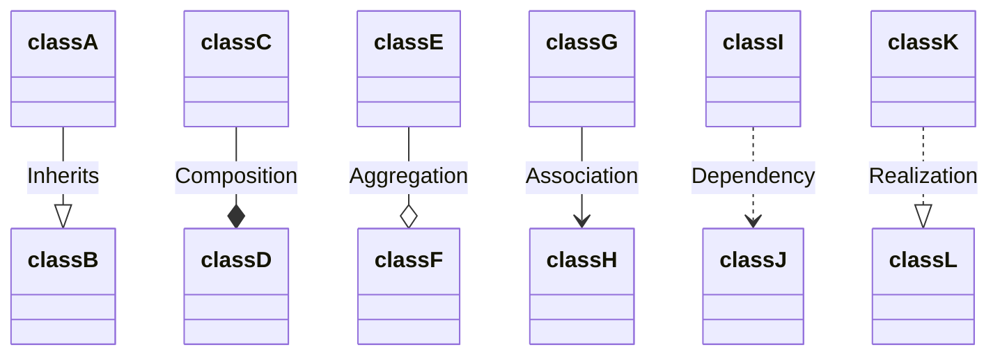
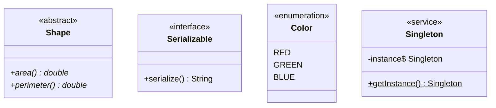
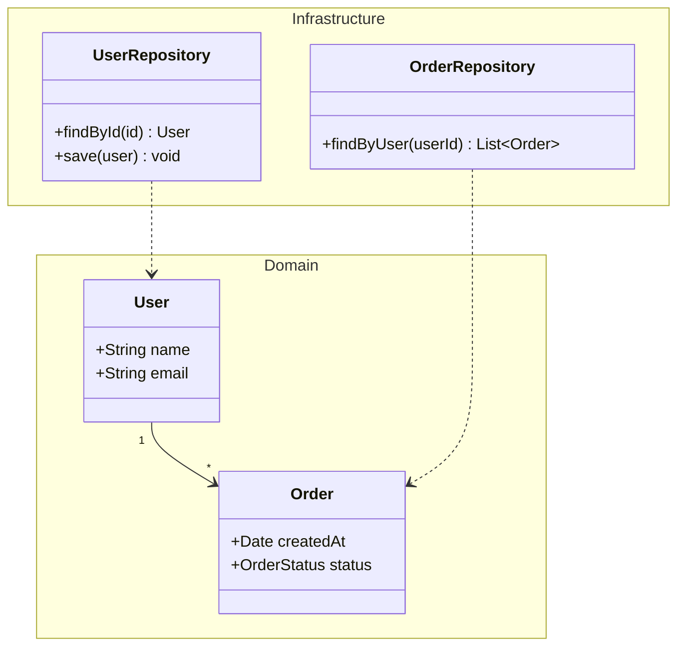
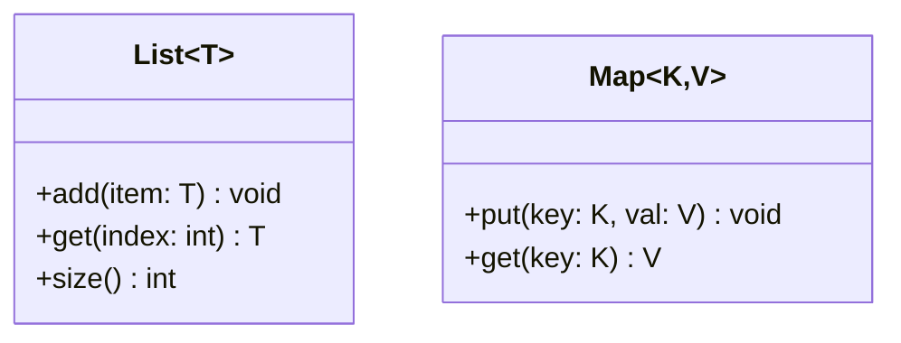
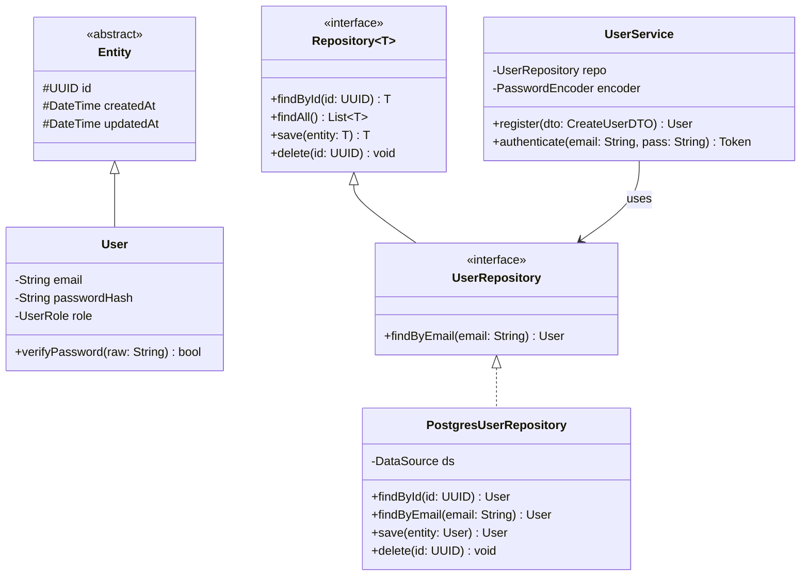
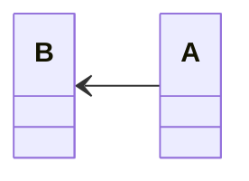

# Class Diagram

Use for object-oriented design, domain models, type hierarchies, and interface contracts.

## Basic Example

## Visibility Modifiers

| Symbol | Meaning |
|--------|---------|
| `+` | Public |
| `-` | Private |
| `#` | Protected |
| `~` | Package/Internal |

## Member Syntax

- `$` suffix = static method/field
- `*` suffix = abstract method
- Return type after method name

## Relationships

| Syntax | Symbol | Meaning | Example |
|--------|--------|---------|---------|
| `<│--` | Solid + closed triangle | Inheritance | Dog inherits Animal |
| `*--` | Solid + filled diamond | Composition | Car owns Engine |
| `o--` | Solid + empty diamond | Aggregation | Team has Members |
| `-->` | Solid + open arrow | Association | Student → Course |
| `..>` | Dashed + open arrow | Dependency | Controller uses Service |
| `..│>` | Dashed + closed triangle | Realization | Class implements Interface |
| `--` | Solid line | Link | Generic relationship |

### Cardinality / Multiplicity

### Relationship Labels

## Annotations

## Namespace / Grouping

## Generics

## Advanced Example: Repository Pattern

## Direction

Available: `TB` (top-bottom, default), `BT`, `LR`, `RL`

## Best Practices

1. **Show only key members** — don't list every getter/setter
2. **Label relationships** — explain what the link means
3. **Use annotations** — mark interfaces, abstract classes, enums clearly
4. **Group with namespace** — organize by layer (domain, infra, application)
5. **Include cardinality** — shows multiplicity constraints
6. **Direction** — use `LR` for wide hierarchies, `TB` for deep ones
7. **Generics** — use `~T~` syntax for parameterized types
