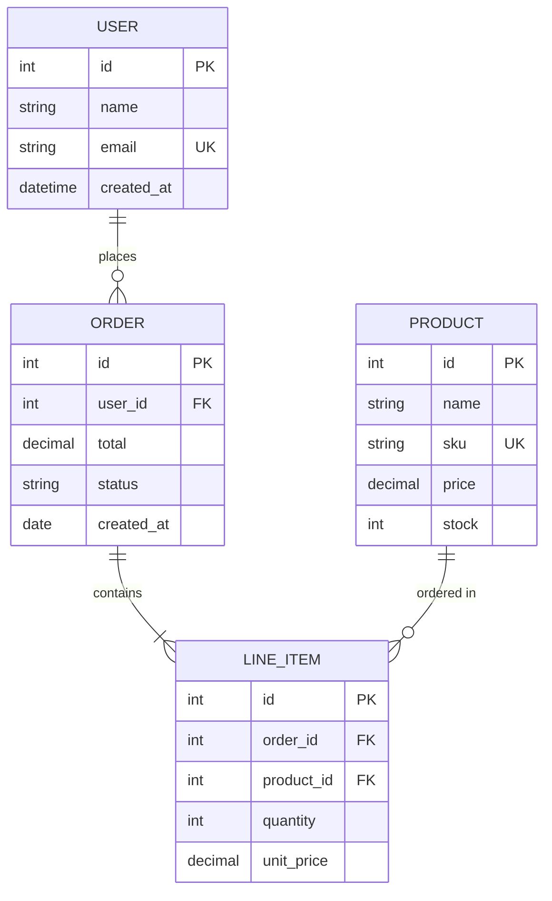
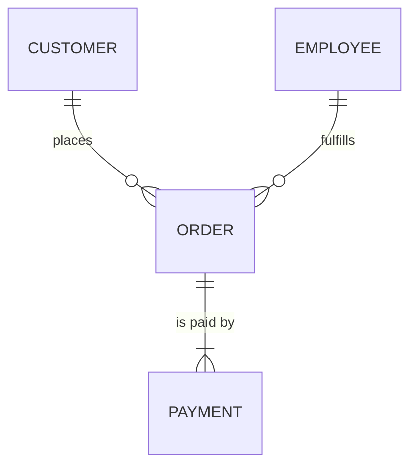
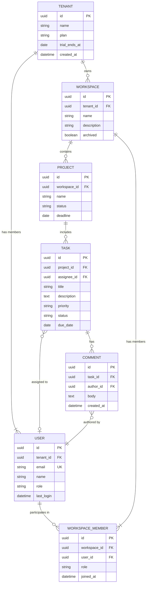
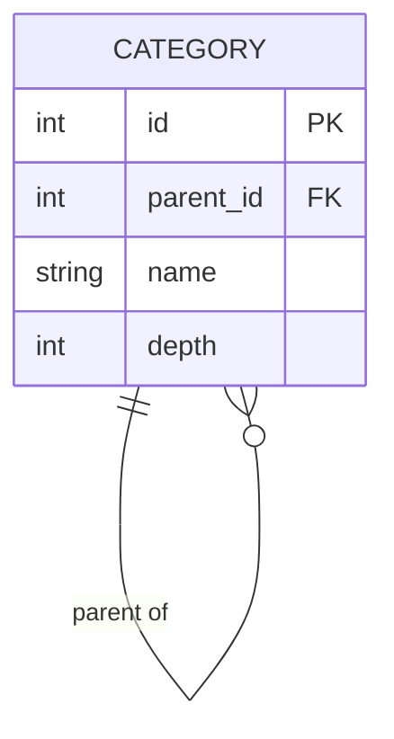
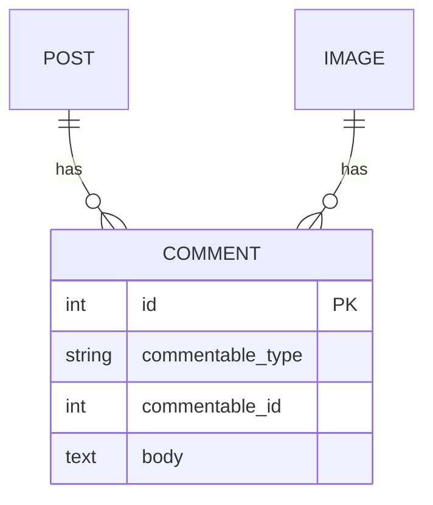
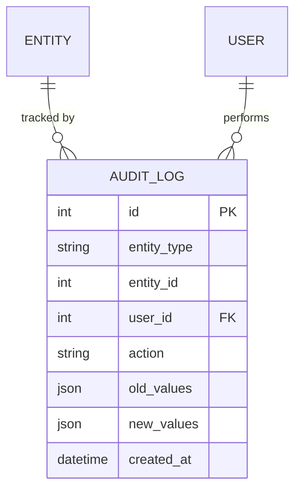

# Entity Relationship Diagram

Use for database design, data models, schema visualization, and domain modeling.

## Basic Example



## Relationship Notation

Cardinality is expressed with the following symbols:

| Left | Right | Meaning |
|------|-------|---------|
| `│|` | `│|` | Exactly one |
| `│|` | `o|` | Zero or one |
| `│|` | `}|` | One or more |
| `│|` | `}o` | Zero or more |

### Common Patterns

| Syntax | Meaning |
|--------|---------|
| `A │|--│| B` | One-to-one (mandatory both sides) |
| `A │|--o| B` | One-to-one (B optional) |
| `A │|--o{ B` | One-to-many (B optional) |
| `A │|--│{ B` | One-to-many (B mandatory) |
| `A }o--o{ B` | Many-to-many (both optional) |

### Relationship Labels

Always label with a verb describing the relationship:



## Attribute Syntax

```
ENTITY {
    type name constraint
}
```

| Constraint | Meaning |
|-----------|---------|
| `PK` | Primary Key |
| `FK` | Foreign Key |
| `UK` | Unique Key |

Common types: `int`, `string`, `text`, `decimal`, `float`, `date`, `datetime`, `boolean`, `uuid`, `json`

## Advanced Example: SaaS Platform



## Design Patterns

### Self-referencing (Tree Structure)



### Polymorphic Association



### Audit Trail



## Best Practices

1. **Name entities in UPPER_CASE** or PascalCase — be consistent
2. **Always label relationships** with a verb phrase
3. **Include PK/FK/UK constraints** — clarifies schema intent
4. **Show only key columns** — not every field; focus on domain-relevant attributes
5. **Use meaningful types** — `uuid` vs `int`, `decimal` vs `float`
6. **Direction matters** — read relationships left-to-right as sentences ("User places Order")
7. **Break large schemas into sub-diagrams** — by bounded context or module
