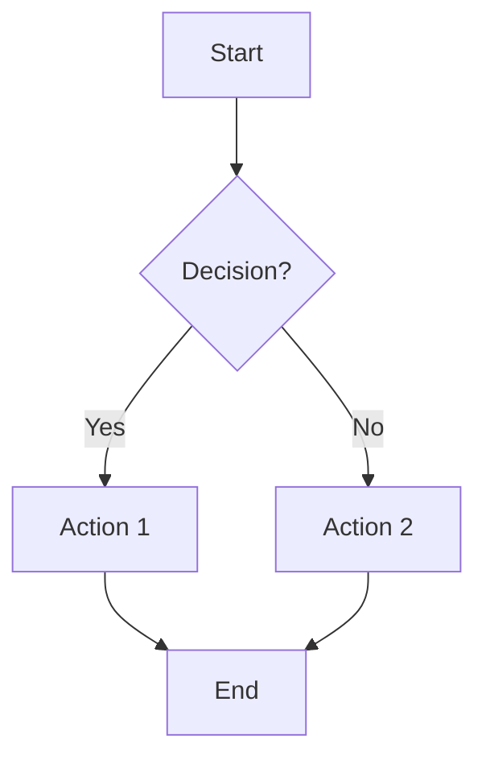
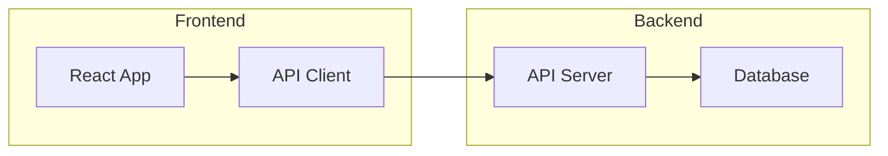
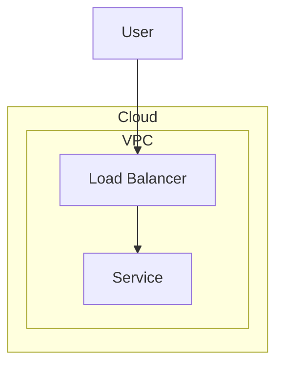
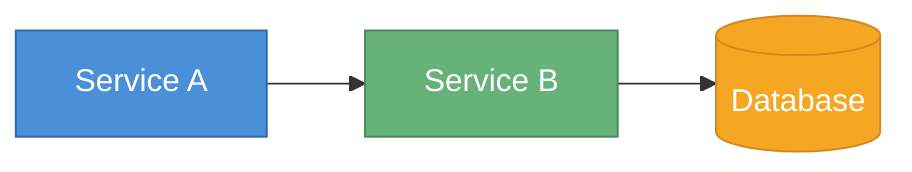
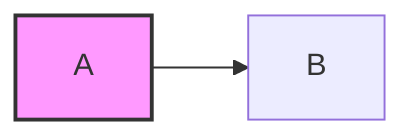
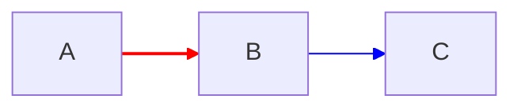
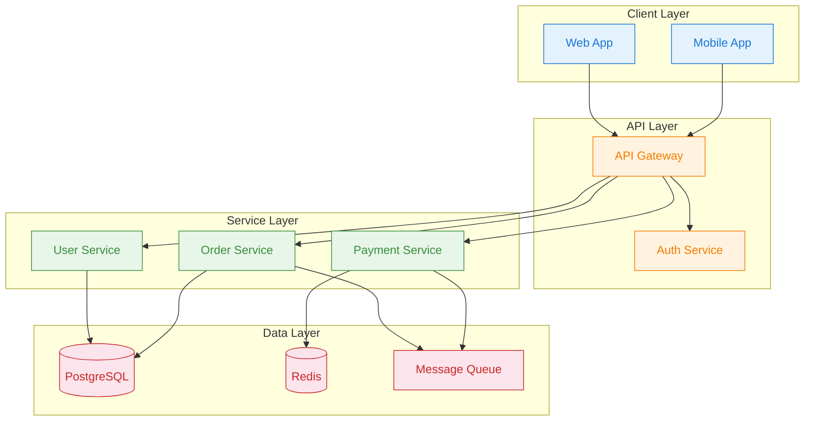
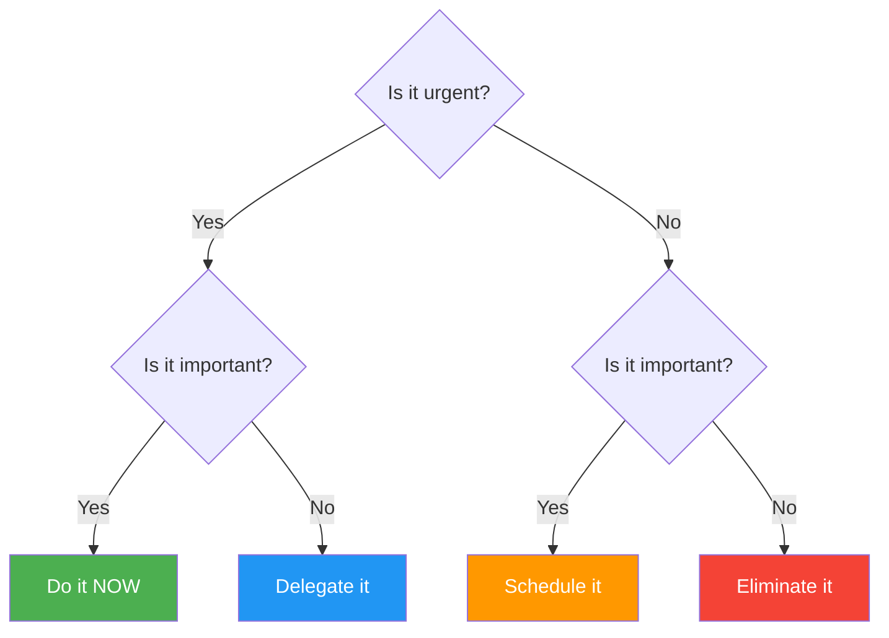

# Flowchart

Use for process flows, decision trees, algorithms, and system architectures.

## Basic Example

## Direction

| Keyword | Direction |
|---------|-----------|
| `TD` / `TB` | Top → Down |
| `LR` | Left → Right |
| `BT` | Bottom → Top |
| `RL` | Right → Left |

- Use `LR` for wide processes (pipelines, data flows)
- Use `TD` for deep hierarchies (org charts, call stacks)

## Node Shapes

| Syntax | Shape | Use For |
|--------|-------|---------|
| `[text]` | Rectangle | Actions, steps |
| `(text)` | Rounded rectangle | Start/End |
| `{text}` | Diamond | Decisions |
| `([text])` | Stadium | Events, triggers |
| `[[text]]` | Subroutine | Sub-processes |
| `[(text)]` | Cylinder | Databases, storage |
| `((text))` | Circle | Connectors |
| `>text]` | Asymmetric | Inputs |
| `{{text}}` | Hexagon | Preparation steps |
| `[/text/]` | Parallelogram | I/O |
| `[\text\]` | Trapezoid alt | Manual operations |

## Link Types

| Syntax | Meaning |
|--------|---------|
| `-->` | Arrow (directional) |
| `---` | Line (undirectional) |
| `-.->` | Dotted arrow |
| `==>` | Thick arrow |
| `-->│label│` | Arrow with label |
| `-- label -->` | Arrow with label (alt) |
| `~~~` | Invisible link (for layout) |

## Subgraphs

Group related nodes:

Subgraphs can be nested and linked:

## Styling

### classDef

### Inline style

### Link style

## Advanced Patterns

### Architecture Diagram

### Decision Tree

## Best Practices

1. **Keep nodes concise** — 3-5 words max per node label
2. **Limit complexity** — max ~15-20 nodes per diagram; split if larger
3. **Group with subgraphs** — reduce visual clutter for related nodes
4. **Consistent link styles** — same style for same relationship type
5. **Use invisible links** (`~~~`) to control layout when nodes misalign
6. **Color with meaning** — error path red, success green, etc.
7. **Node ID pattern** — use meaningful short IDs (`usr`, `db`, `svc`) not generic (`A`, `B`, `C`)
