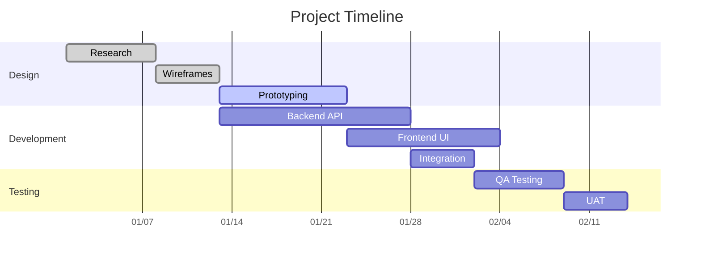
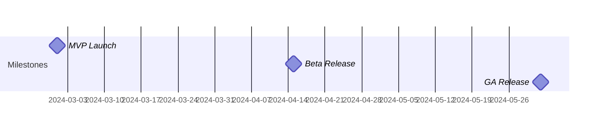
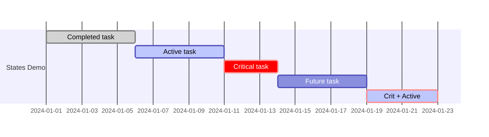
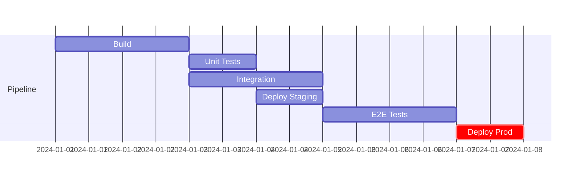
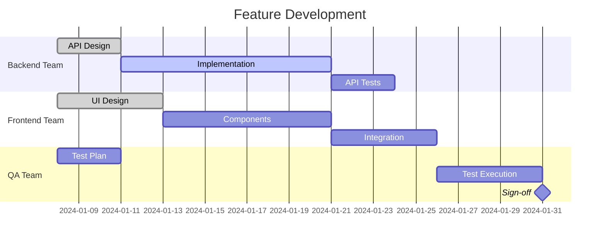
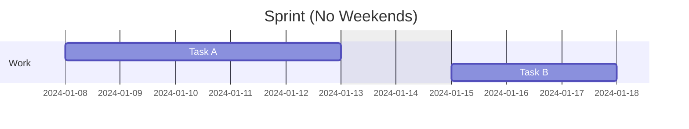
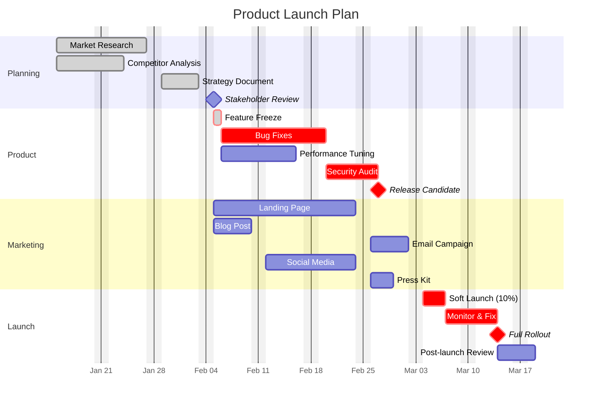

# Gantt Chart

Use for project planning, sprint scheduling, release timelines, and task dependencies.

## Basic Example



## Configuration Directives

| Directive | Example | Description |
|-----------|---------|-------------|
| `title` | `title Sprint 42` | Chart title |
| `dateFormat` | `dateFormat YYYY-MM-DD` | Input date format |
| `axisFormat` | `axisFormat %Y-%m-%d` | Display format on axis |
| `tickInterval` | `tickInterval 1week` | Axis tick spacing |
| `excludes` | `excludes weekends` | Skip non-working days |
| `todayMarker` | `todayMarker stroke-width:3px,stroke:#f00` | Today line style |

## Task Syntax

```
Task name : [status], [id], [start], [duration/end]
```

| Field | Options |
|-------|---------|
| Status | `done`, `active`, `crit` (critical path), or omit |
| ID | Alphanumeric identifier for dependencies |
| Start | Date (`2024-01-15`) or `after taskId` |
| Duration/End | `7d`, `2w`, `1m`, or end date |

### Milestones



## Task States



## Dependencies



Multiple dependencies: `after task1 task2` — starts after both complete.

## Sections

Group tasks by team, phase, or module:



## Excluding Days



## Advanced Example: Product Launch



## Best Practices

1. **Use sections** — group by team, phase, or workstream
2. **Mark critical path** — `crit` highlights what blocks the deadline
3. **Show dependencies** — use `after taskId` to reveal bottlenecks
4. **Keep task names short** — 2-4 words max
5. **Use milestones** — mark key decision points and deliverables
6. **Exclude weekends** — `excludes weekends` for realistic timelines
7. **Assign IDs** — every task should have an ID for dependency referencing
8. **Use `axisFormat`** — choose date display that matches the time scale
