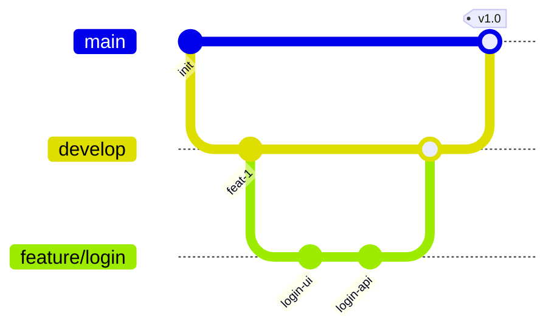
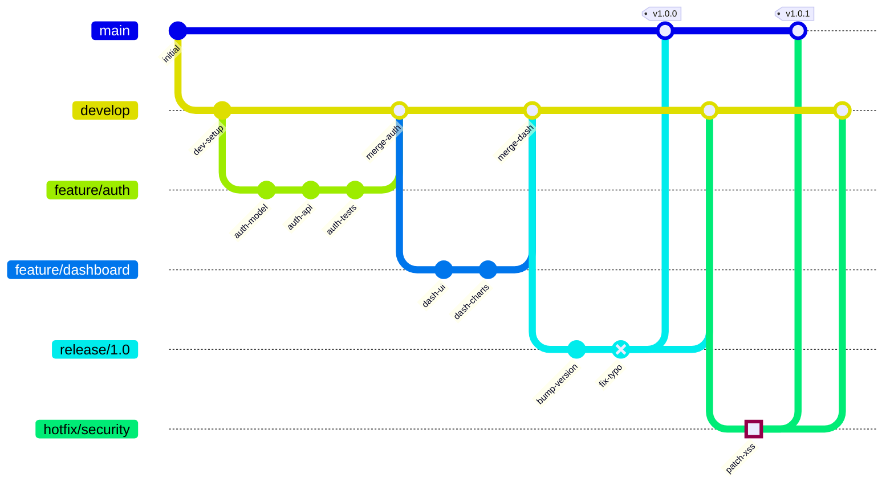
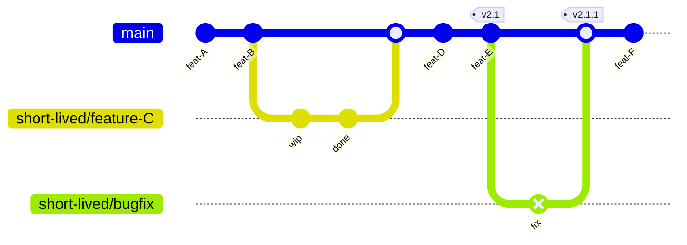
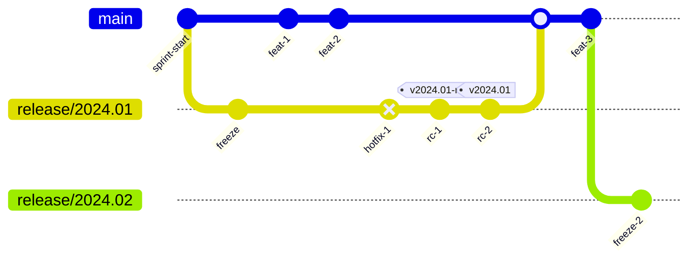
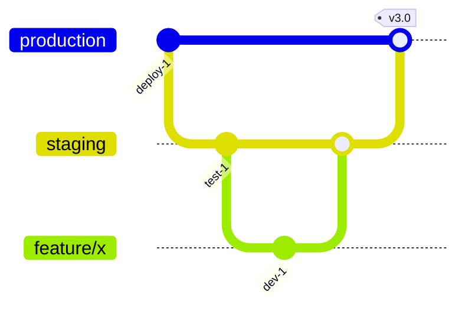

# Gitgraph

Use for branching strategies, release flows, version control workflows, and CI/CD pipeline visualization.

## Basic Example



## Syntax

| Command | Description |
|---------|-------------|
| `commit` | Add a commit to current branch |
| `branch name` | Create and switch to new branch |
| `checkout name` | Switch to existing branch |
| `merge name` | Merge named branch into current |
| `cherry-pick id: "x"` | Cherry-pick a commit |

### Commit Options

```
commit id: "msg" tag: "v1.0" type: NORMAL
```

| Option | Values |
|--------|--------|
| `id` | Commit message/ID string |
| `tag` | Version tag to display |
| `type` | `NORMAL`, `REVERSE`, `HIGHLIGHT` |

## Git Flow Example



## Trunk-Based Development



## Release Train



## Configuration



## Best Practices

1. **Show the strategy** — make branching intent clear (Git Flow, trunk-based, etc.)
2. **Use meaningful commit IDs** — describe what each commit represents
3. **Tag releases** — mark release points with version tags
4. **Highlight special commits** — use `type: HIGHLIGHT` for important changes, `REVERSE` for fixes
5. **Keep branch names short** — `feature/auth` not `feature/implement-oauth2-authentication`
6. **Show merge direction** — merge into the correct target branch
7. **Limit branches** — show 3-5 branches max per diagram
