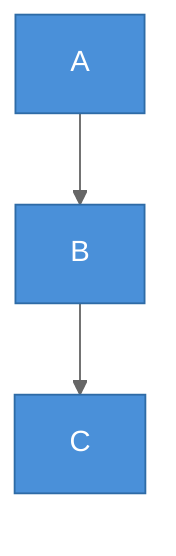
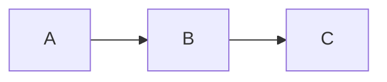

# Mermaid Diagram Guide

Create Mermaid diagrams — flowcharts, sequence diagrams, class diagrams, state diagrams, ER diagrams, Gantt charts, mindmaps, timelines, quadrant charts, and more.

---

## Select Diagram Type

Use this decision tree to pick the right diagram type, then read the corresponding file in this directory for full syntax, examples, and best practices.

```
What are you visualizing?
├─ Process / Logic flow → Flowchart
├─ Interaction between actors over time → Sequence Diagram
├─ Object-oriented structure → Class Diagram
├─ State transitions → State Diagram
├─ Database schema / entity relationships → ER Diagram
├─ Project timeline / scheduling → Gantt Chart
├─ Hierarchical concepts / brainstorming → Mindmap
├─ Chronological events → Timeline
├─ Git branching strategy → Gitgraph
├─ Proportional data → Pie Chart
├─ 2D classification / positioning → Quadrant Chart
├─ User journey / experience flow → User Journey
├─ System context / containers (C4) → C4 Diagram
├─ Requirements tracing → Requirement Diagram
├─ Block-based architecture → Block Diagram
└─ Packet/protocol structure → Packet Diagram
```

### Reference Files

| Diagram Type | File | Use For |
|-------------|------|---------|
| Flowchart | `flowchart.md` | Process flows, decision trees, architectures |
| Sequence | `sequence.md` | API calls, protocol flows, service interactions |
| Class | `class.md` | OOP design, domain models, type hierarchies |
| State | `state.md` | FSM, lifecycle management, workflow states |
| ER | `er.md` | Database design, data models, schemas |
| Gantt | `gantt.md` | Project timelines, sprints, task dependencies |
| Mindmap | `mindmap.md` | Brainstorming, concept hierarchies |
| Timeline | `timeline.md` | Chronological events, release history |
| Pie | `pie.md` | Simple proportional data |
| Gitgraph | `gitgraph.md` | Branching strategies, release flows |
| Quadrant | `quadrant.md` | Priority matrices, 2D classification |
| User Journey | `journey.md` | UX flows, customer journeys |
| C4 | `c4.md` | System architecture (Context/Container/Component) |

---

## Quick Syntax Cheat Sheet

**Flowchart:** `flowchart TD` / `LR` + nodes `[rect]` `{diamond}` `[(cylinder)]` + links `-->` `-.->` `==>`

**Sequence:** `sequenceDiagram` + `participant` + `->>` / `-->>` + `activate` / `alt` / `loop` / `par`

**Class:** `classDiagram` + `class Name { }` + `<|--` / `*--` / `o--` / `-->` / `..>`

**State:** `stateDiagram-v2` + `[*]` + `-->` + `state Name { }` + `<<choice>>` / `<<fork>>`

**ER:** `erDiagram` + `||--o{` / `||--|{` + entity attributes `{ type name PK }`

**Gantt:** `gantt` + `section` + tasks `:done/active/crit, id, start, duration`

**Mindmap:** `mindmap` + `root((text))` + indentation hierarchy

---

## Styling & Theming

### classDef (Flowchart/State)


### Theme Configuration (All Diagrams)



Built-in themes: `default`, `neutral`, `dark`, `forest`, `base`

---

## Output Formats

### Option A: Raw Mermaid Code Block (Default)

Return as a fenced code block with `mermaid` language tag. Works in GitHub, GitLab, Notion, Obsidian, and most markdown renderers.

````markdown

````

### Option B: Self-Contained HTML File

When the user wants a rendered visual file, produce a single `index.html`:

```html
<!DOCTYPE html>
<html lang="en">
<head>
    <meta charset="UTF-8">
    <meta name="viewport" content="width=device-width, initial-scale=1.0">
    <title>Mermaid Diagram</title>
    <style>
        * { margin: 0; padding: 0; box-sizing: border-box; }
        body {
            font-family: -apple-system, BlinkMacSystemFont, 'Segoe UI', sans-serif;
            background: #fafbfc;
            display: flex;
            justify-content: center;
            align-items: center;
            min-height: 100vh;
            padding: 2rem;
        }
        .container {
            background: #fff;
            border-radius: 8px;
            padding: 2rem;
            box-shadow: 0 1px 3px rgba(0,0,0,0.1);
            max-width: 100%;
            overflow-x: auto;
        }
        .mermaid { text-align: center; }
    </style>
</head>
<body>
    <div class="container">
        <pre class="mermaid">
            <!-- Mermaid code here -->
        </pre>
    </div>
    <script src="./_shared/js/mermaid.min.js"></script>
    <script>
        mermaid.initialize({
            startOnLoad: true,
            theme: 'default',
            securityLevel: 'loose',
            flowchart: { curve: 'basis', padding: 20 },
            sequence: { mirrorActors: false },
        });
    </script>
</body>
</html>
```

**Note**: The example above uses the local bundled `mermaid.min.js` (copied to `_shared/js/` by the report scaffold). No CDN required.

---

## General Best Practices

1. **Keep diagrams focused** — one diagram per concept. Split complex systems into multiple diagrams.
2. **Readable node labels** — 2-5 words per node. Use abbreviations or IDs for long names.
3. **Consistent direction** — pick one flow direction and stick with it.
4. **Limit complexity** — max ~20 nodes per flowchart, ~8 participants per sequence, ~15 states per state diagram.
5. **Use subgraphs/groups** — reduce visual clutter by grouping related elements.
6. **Label all relationships** — arrows without labels are ambiguous.
7. **Color with purpose** — encode meaning (red = error, green = success), not decoration.
8. **Target Mermaid v10+** — stick to stable syntax; avoid experimental features.

---

## Common Pitfalls

| Issue | Solution |
|-------|----------|
| Node text with special chars breaks | Wrap in quotes: `A["Text with (parens)"]` |
| Long labels cause overlap | Use short IDs + `<br/>` for line breaks |
| Diagram too wide | Switch direction (LR → TD) or split into sub-diagrams |
| Links crossing confusingly | Reorder node definitions to minimize crossings |
| Subgraph styling not applied | Use `classDef` after subgraph definition |
| Mermaid version incompatibility | Stick to core syntax; avoid experimental features |
