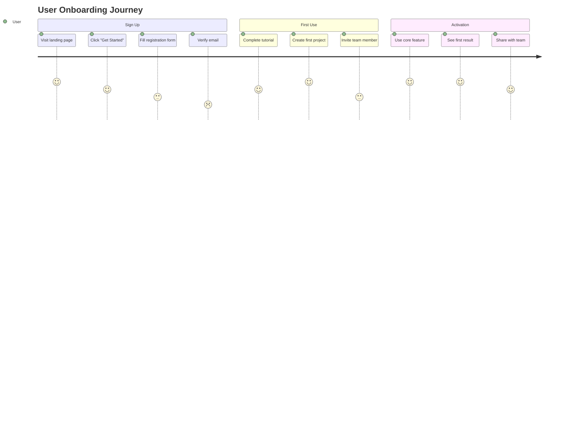
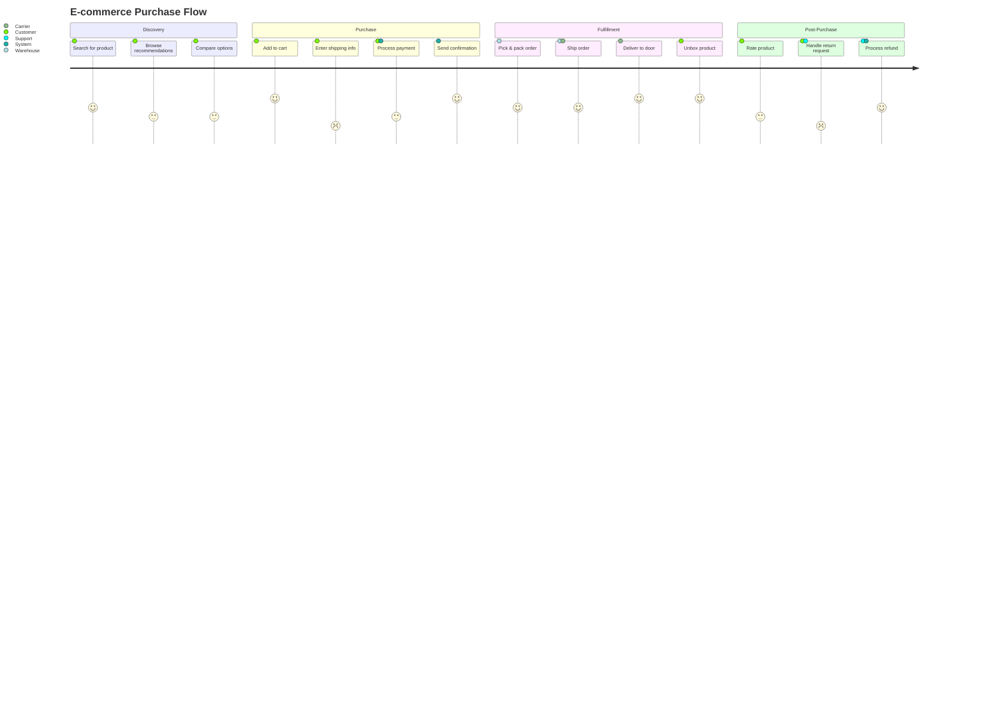
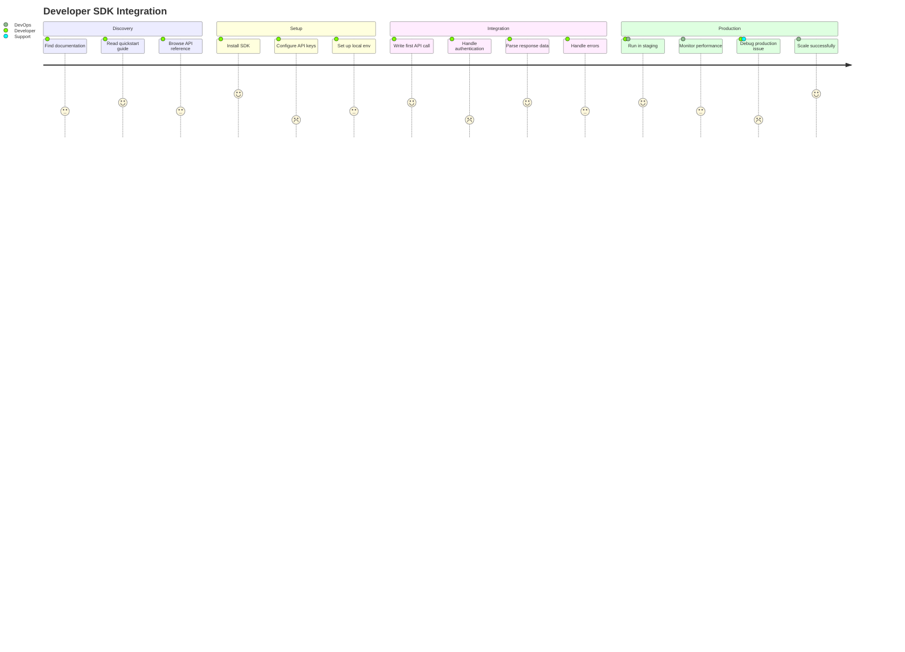

# User Journey

Use for user experience flows, customer journeys, satisfaction mapping, and service design.

## Basic Example



## Syntax

```
journey
    title [Journey title]
    section [Phase name]
        [Task description]: [score]: [actor1, actor2]
```

- **Score**: 1 (very negative) to 5 (very positive) — represents satisfaction/mood
- **Actors**: Who performs this step (comma-separated for multiple)

## Multi-Actor Journey



## Developer Experience Journey



## Scoring Guide

| Score | Meaning | Indicator |
|-------|---------|-----------|
| 5 | Delighted | Exceeds expectations, effortless |
| 4 | Satisfied | Works well, minor friction |
| 3 | Neutral | Gets the job done, nothing special |
| 2 | Frustrated | Confusing, requires effort |
| 1 | Angry | Broken, blocked, wants to quit |

## Best Practices

1. **3-5 sections** — represent major phases of the journey
2. **3-5 tasks per section** — enough detail without overwhelming
3. **Honest scores** — reflect real user sentiment, not aspirational targets
4. **Identify pain points** — scores 1-2 are where to focus improvement
5. **Multiple actors** — shows handoffs and collaboration points
6. **Action-oriented tasks** — use verb phrases ("Submit form", "Wait for approval")
7. **Chronological flow** — order tasks as they actually happen
