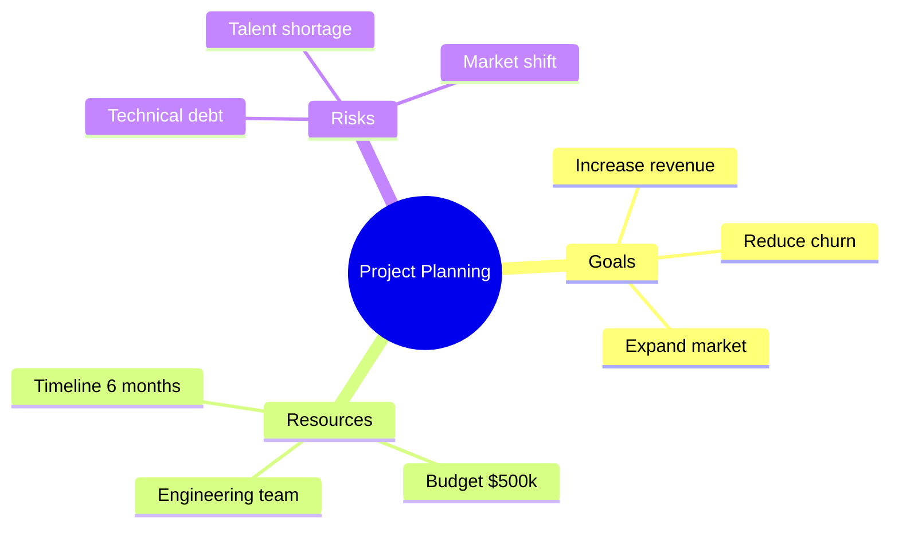
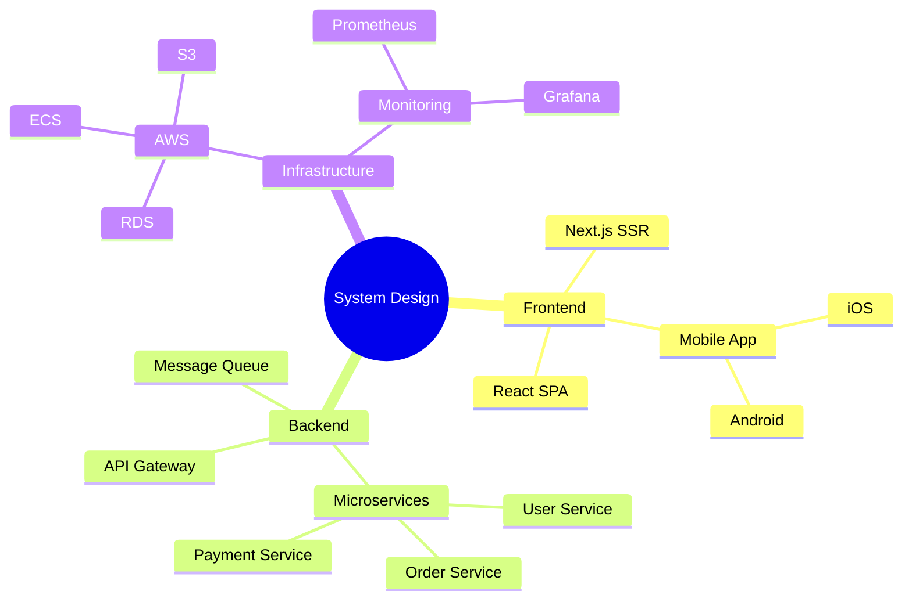
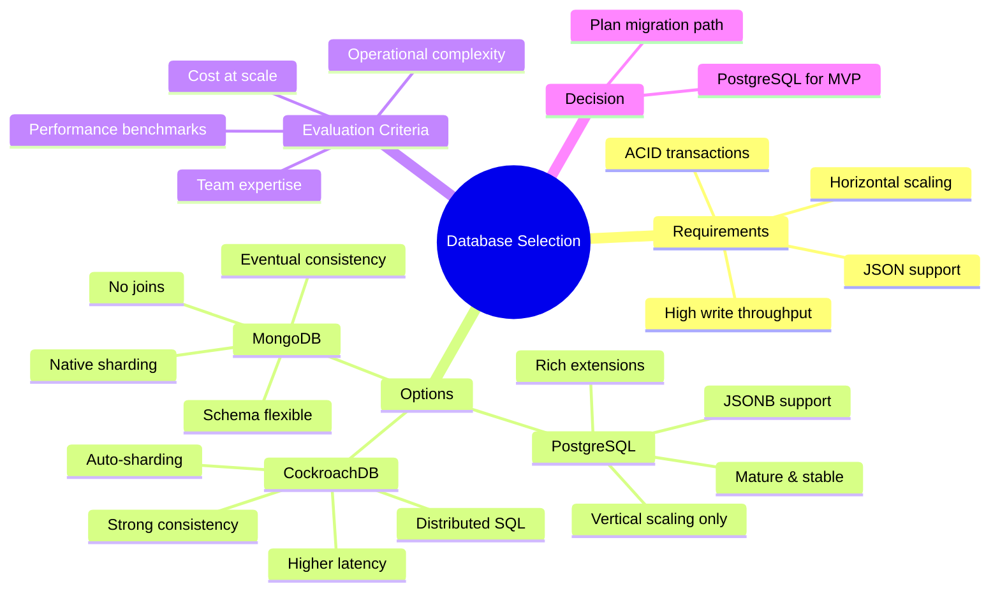
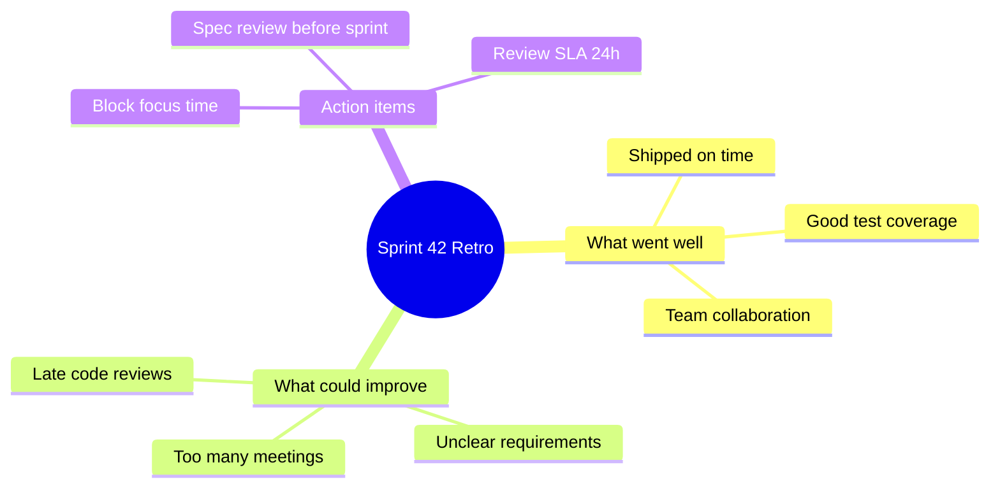

# Mindmap

Use for brainstorming, concept hierarchies, topic decomposition, and knowledge organization.

## Basic Example

## Node Shapes

| Syntax | Shape | Use For |
|--------|-------|---------|
| `root((text))` | Circle | Central topic |
| `root[text]` | Square | Structured root |
| `root)text(` | Cloud/Bang | Creative root |
| `id(text)` | Rounded | Sub-topics |
| `id[text]` | Square | Concrete items |
| `id))text((` | Hexagon | Categories |
| Default (just text) | Pill | Leaf items |

## Hierarchy by Indentation

Depth is determined by indentation level (spaces):

## Advanced Example: Technical Decision

## Example: Sprint Retrospective

## Best Practices

1. **Central topic as root** — one clear main concept
2. **3-5 main branches** — too many branches loses focus
3. **Consistent depth** — keep branches roughly same depth (2-4 levels)
4. **Short labels** — 1-4 words per node
5. **Balance** — distribute sub-topics evenly across branches
6. **Use shapes for emphasis** — circle for root, different shapes for key nodes
