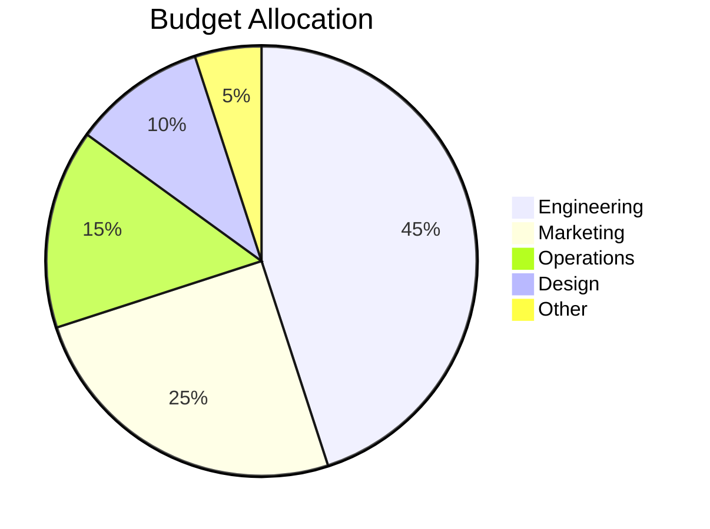
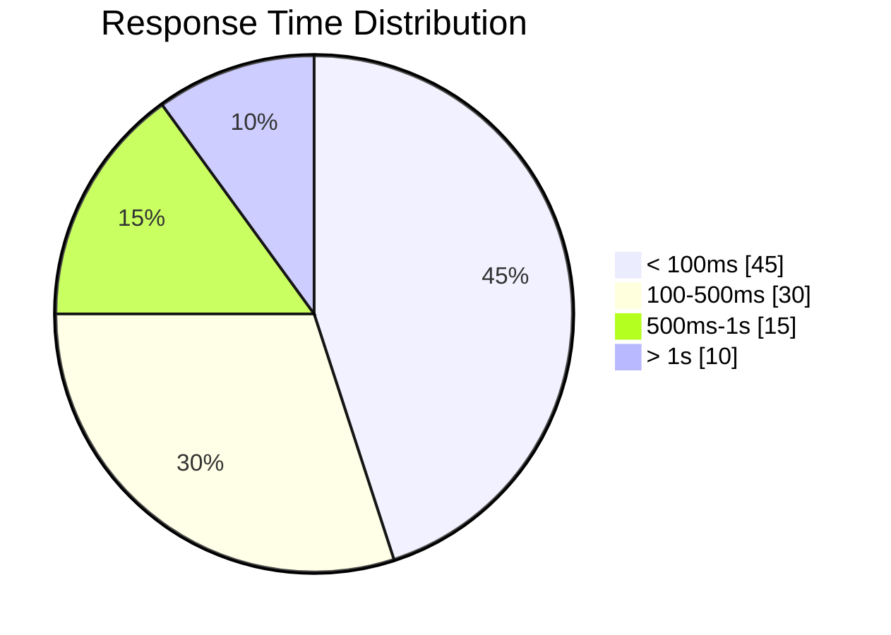
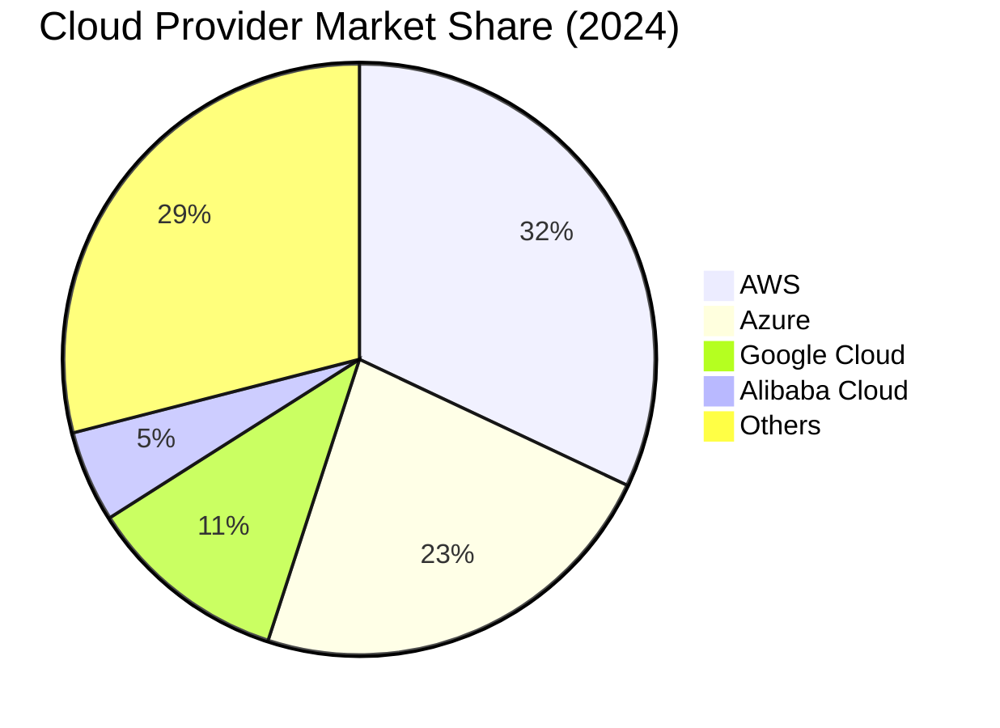

# Pie Chart

Use for simple proportional data display when showing parts of a whole.

## Basic Example



## Syntax

```
pie [showData] [title Title Text]
    "Label" : value
    "Label" : value
```

- Values are proportional (percentages auto-calculated)
- `showData` — optional flag to display values on chart

## Show Data Values



## Advanced Example



## Best Practices

1. **Max 5-7 slices** — too many slices become unreadable
2. **Order by size** — largest to smallest (or logical grouping)
3. **Use descriptive labels** — clearly identify each segment
4. **Include title** — always add context with `title`
5. **Prefer other charts for complex data** — pie charts are best for simple proportions only
6. **Avoid when comparing similar values** — bar charts are better for precise comparison

## When NOT to Use Pie Charts

- Comparing values that are close in size (use bar chart)
- Showing trends over time (use line chart)
- More than 7 categories (use horizontal bar)
- Exact values matter more than proportions (use table or bar)
