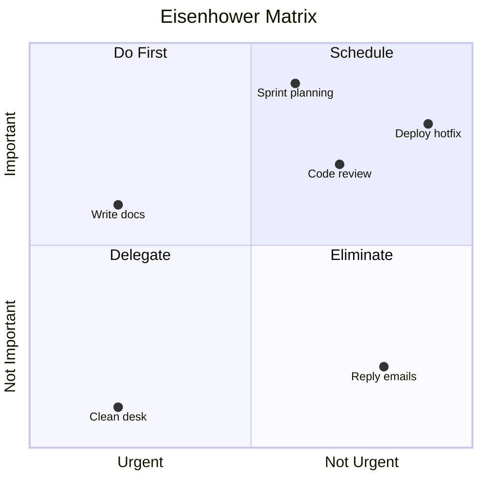
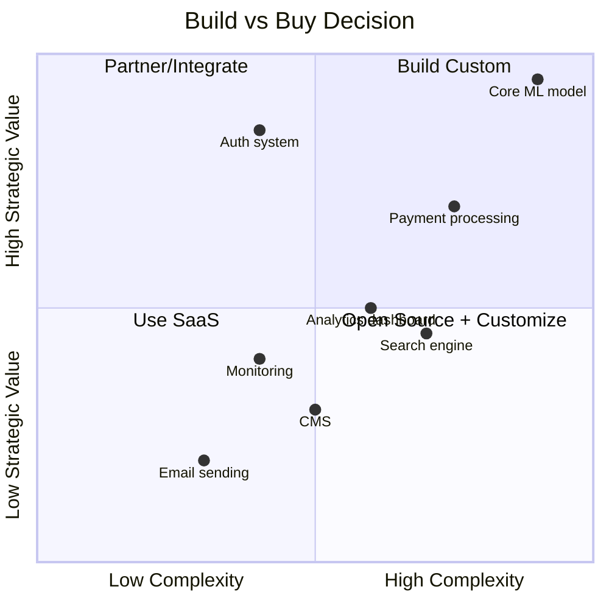
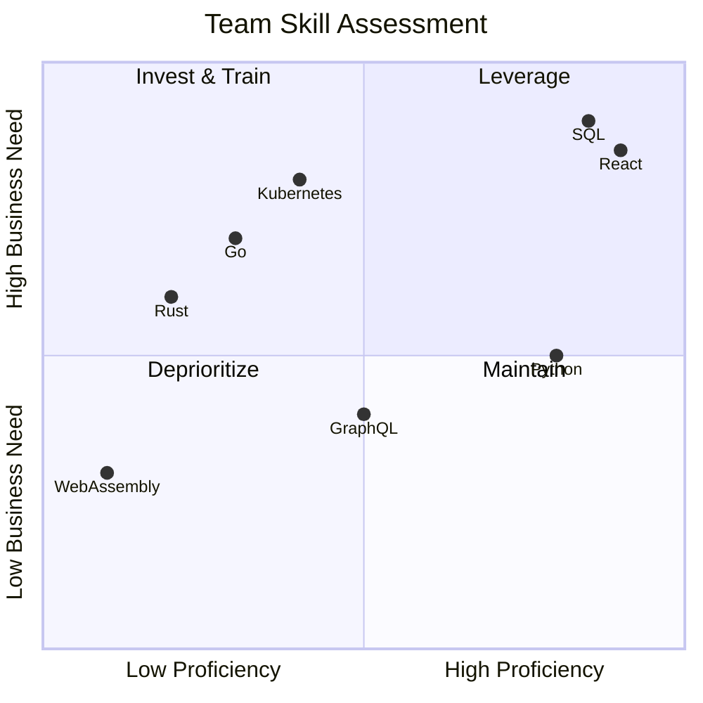
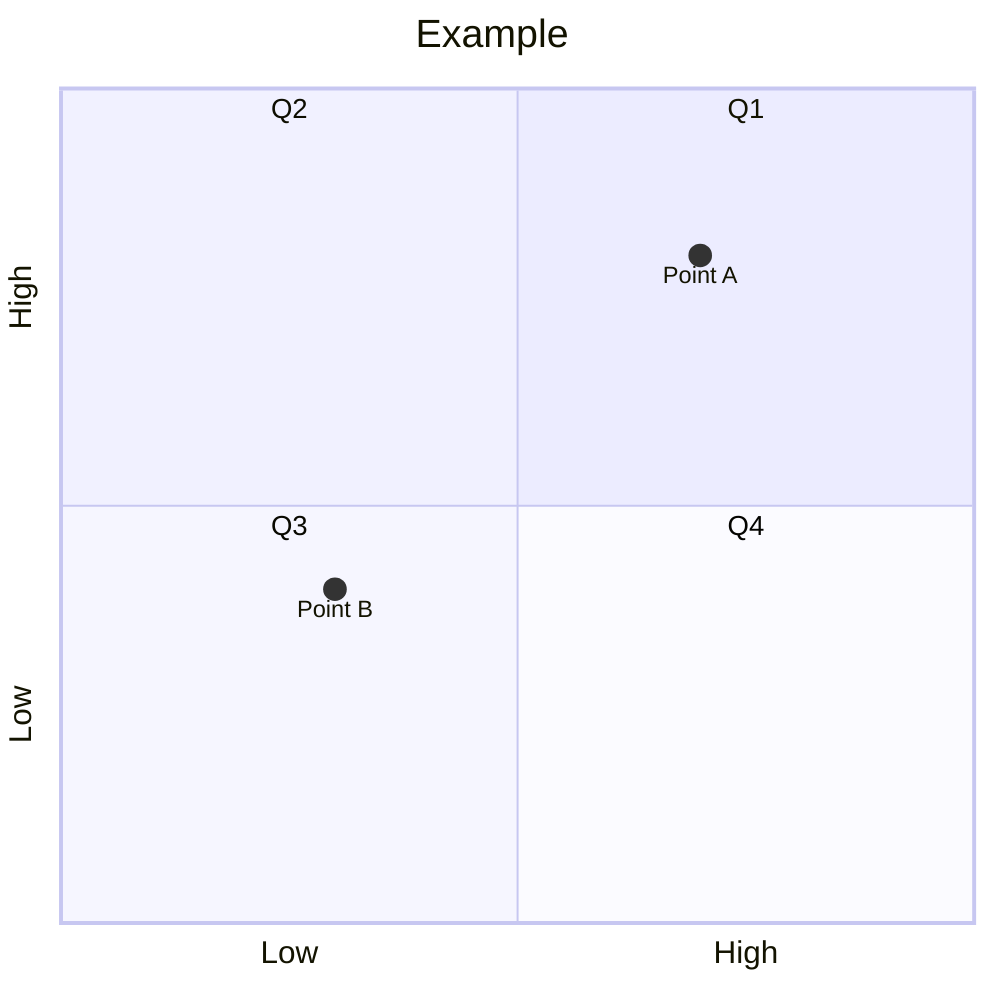

# Quadrant Chart

Use for 2D classification, priority matrices, strategic positioning, and comparative analysis.

## Basic Example



## Syntax

```
quadrantChart
    title [Chart title]
    x-axis [Low label] --> [High label]
    y-axis [Low label] --> [High label]
    quadrant-1 [Top-right label]
    quadrant-2 [Top-left label]
    quadrant-3 [Bottom-left label]
    quadrant-4 [Bottom-right label]
    [Point name]: [x, y]
```

- Coordinates range from `0.0` to `1.0`
- Quadrant numbering: 1=top-right, 2=top-left, 3=bottom-left, 4=bottom-right

## Technology Radar Example



## Team Skills Matrix



## Configuration



## Best Practices

1. **Clear axis labels** — both ends should describe opposing concepts
2. **Meaningful quadrant names** — action-oriented labels (Do, Schedule, Delegate, Eliminate)
3. **5-12 data points** — too few lacks insight, too many creates clutter
4. **Spread distribution** — ensure points aren't all clustered in one quadrant
5. **Actionable** — each quadrant should imply a clear action or decision
6. **Descriptive point names** — 1-3 words that identify the item
