# Sequence Diagram

Use for API calls, protocol flows, microservice interactions, and time-ordered messaging between actors.

## Basic Example

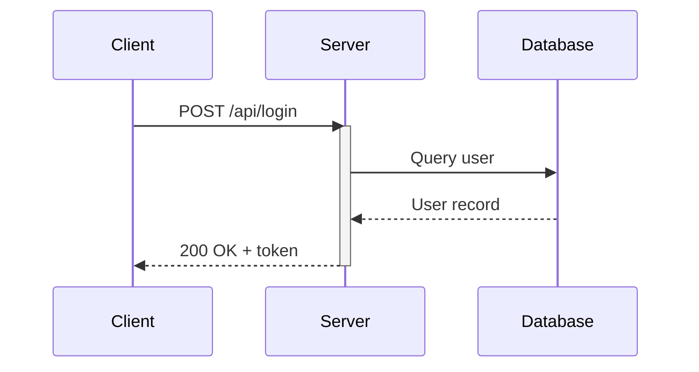

## Participants

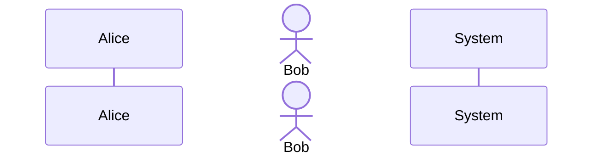

- `participant` — box shape (for systems/services)
- `actor` — stick figure (for people)
- Use `as` for short display names

## Message Types

| Syntax | Meaning | Use For |
|--------|---------|---------|
| `->>` | Solid arrow | Synchronous request |
| `-->>` | Dashed arrow | Response / return |
| `--)` | Solid open arrow | Async message (fire & forget) |
| `--x` | Dashed X | Lost message |
| `->>+` | Arrow + activate | Request that starts processing |
| `-->>-` | Arrow + deactivate | Response that ends processing |

## Activation Bars

Show processing time with explicit or inline activation:

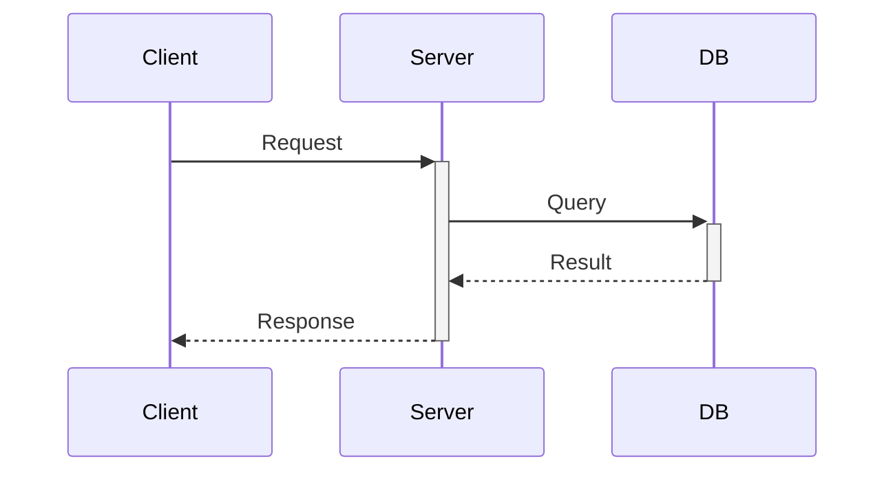

## Interaction Fragments

### Alternatives (if/else)

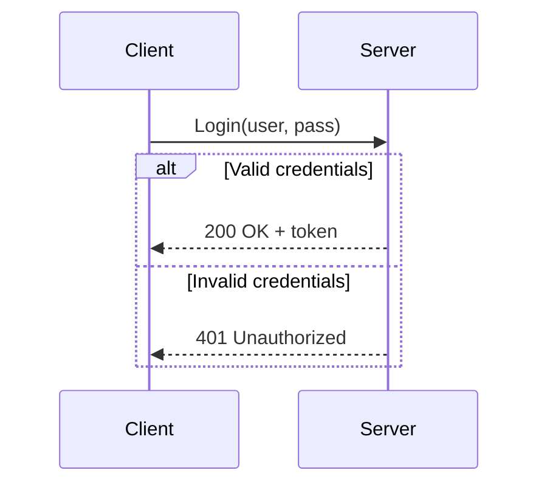

### Loops

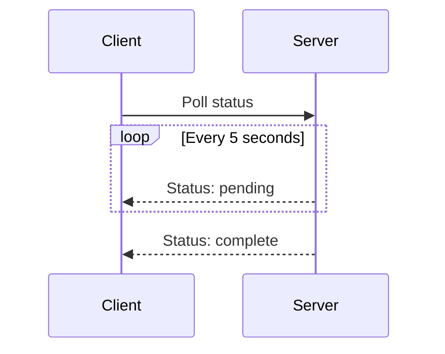

### Optional

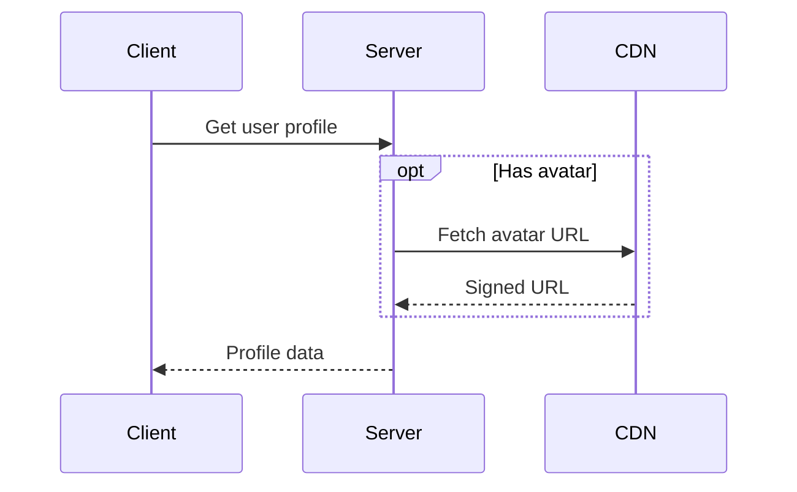

### Parallel

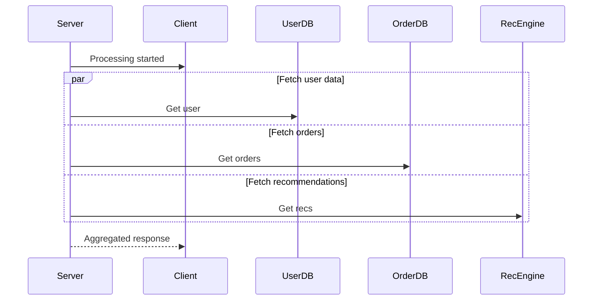

### Critical Region

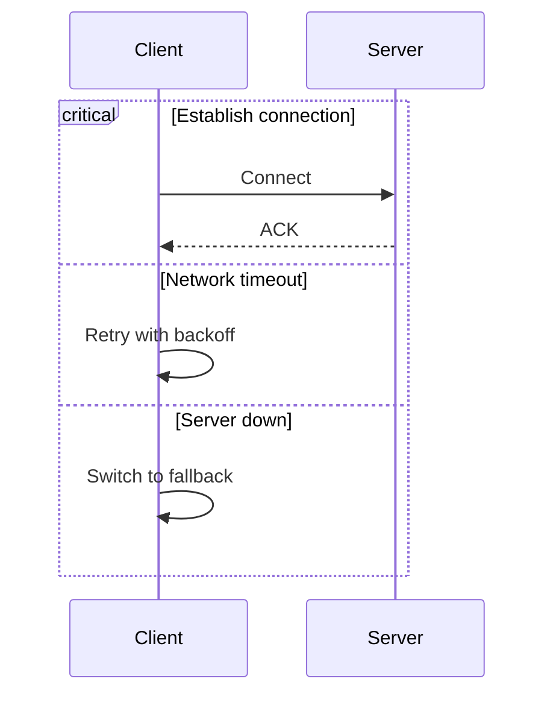

## Notes

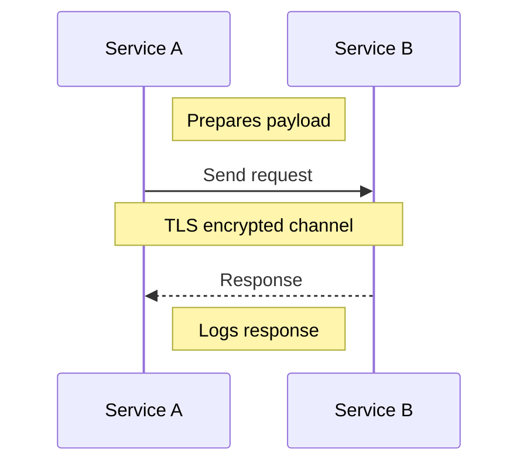

## Highlights (rect)

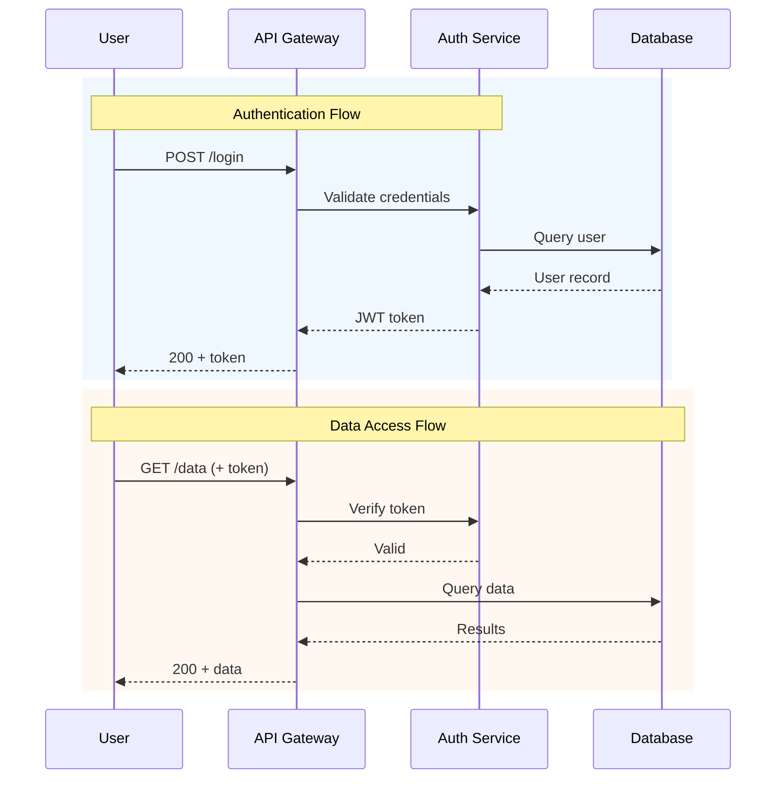

## Numbering

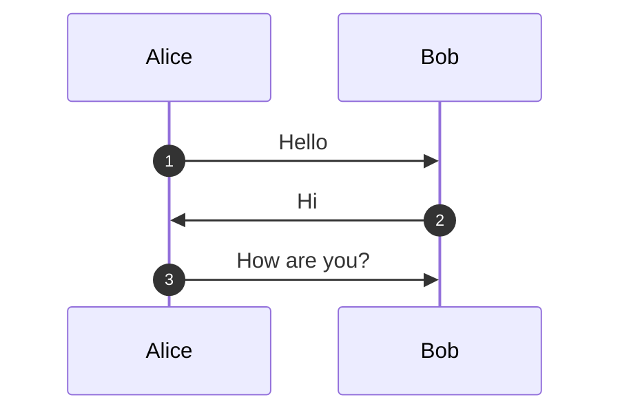

## Advanced Example: OAuth2 Flow

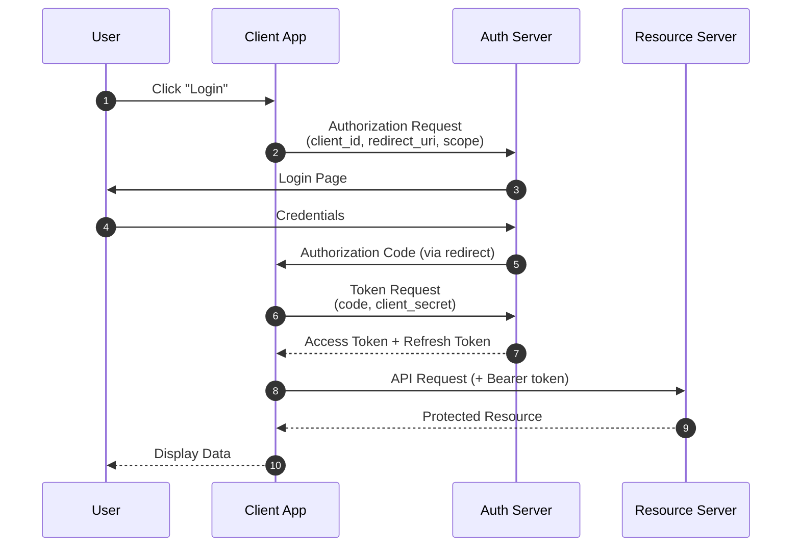

## Best Practices

1. **Limit participants** — max 5-7 per diagram; split if more
2. **Always show returns** — every request should have a matching response
3. **Use activation bars** — clearly shows which service is "working"
4. **Label messages clearly** — include HTTP methods, event names, or action descriptions
5. **Group with rect** — highlight logical phases with colored rectangles
6. **Use autonumber** — helpful for referencing specific steps in documentation
7. **Alias long names** — `participant GW as API Gateway` keeps the diagram compact
8. **Show error paths** — use `alt` for success/failure branches
