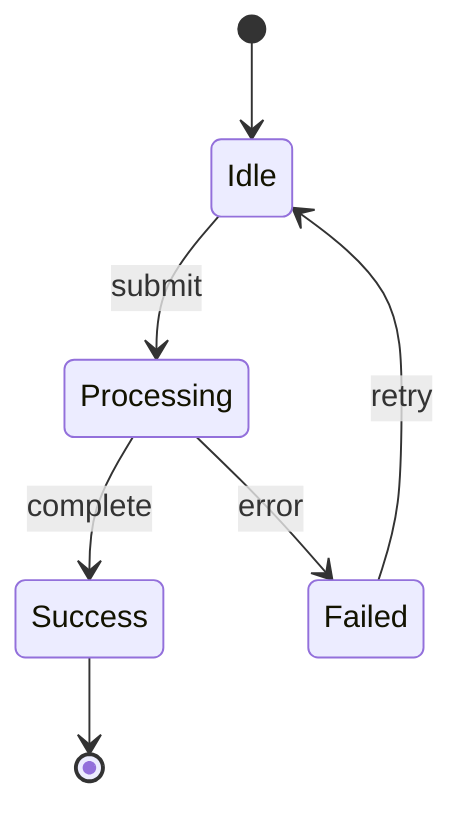
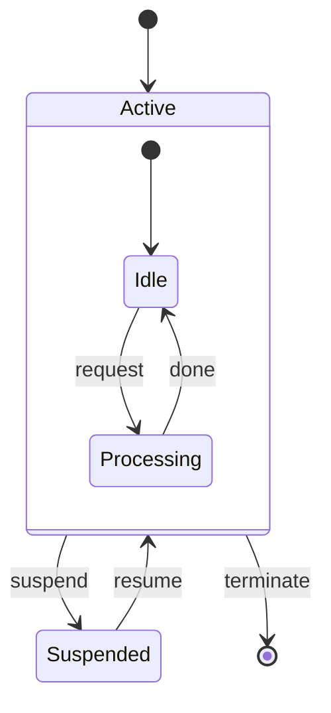
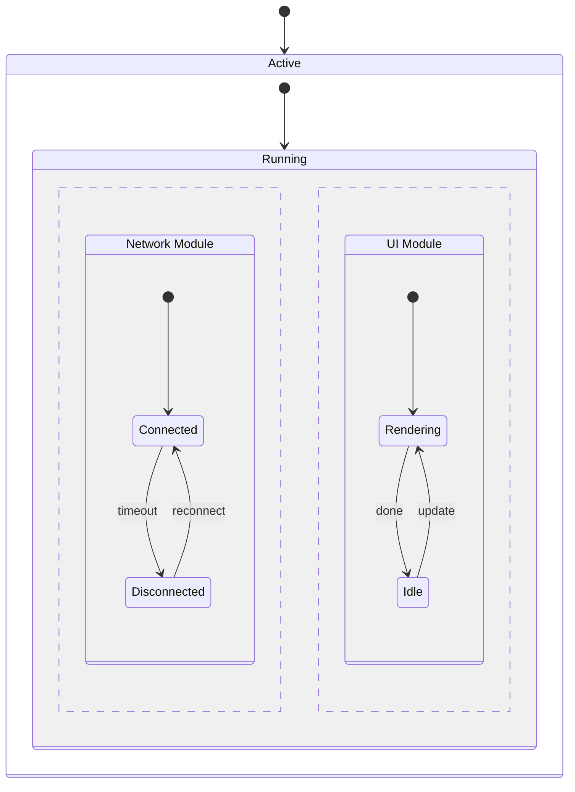
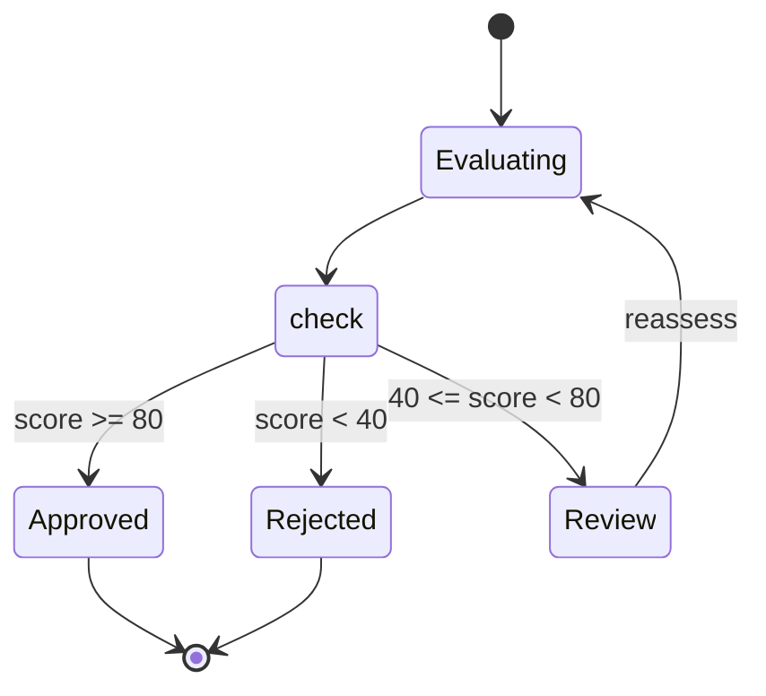
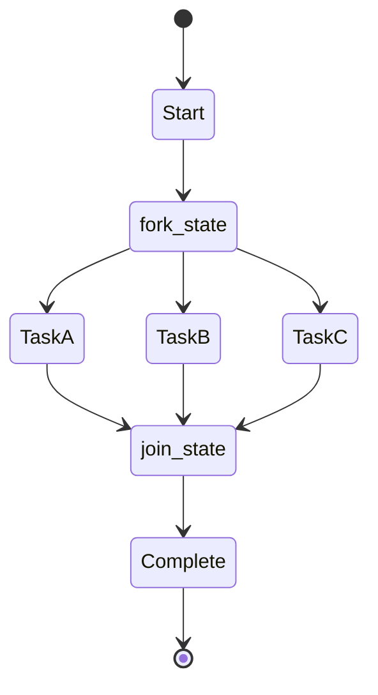
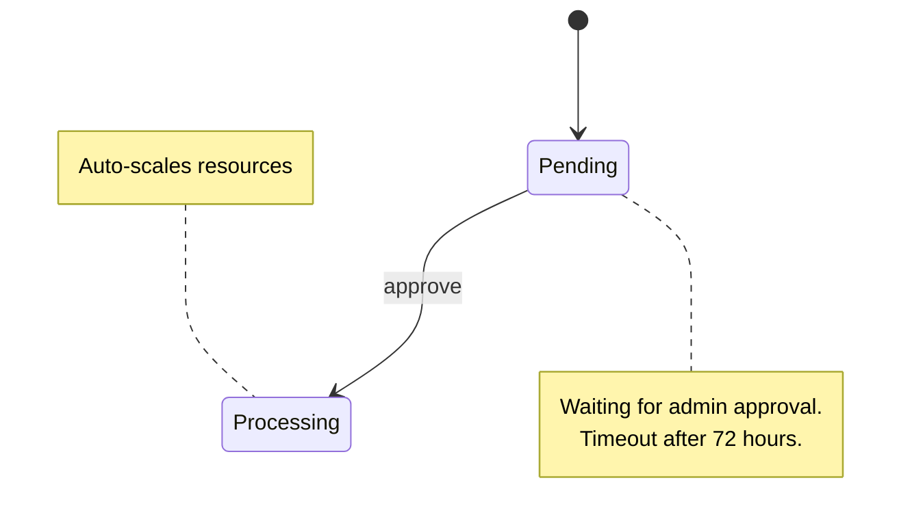
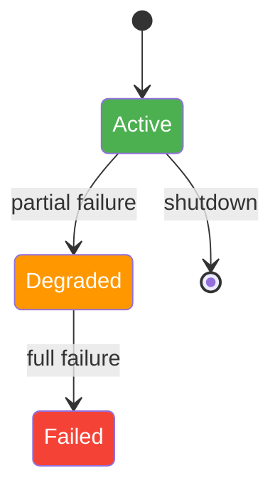
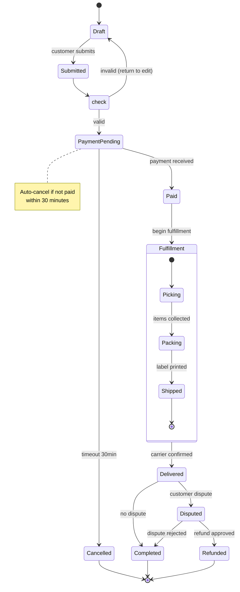
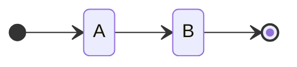

# State Diagram

Use for finite state machines, lifecycle management, workflow states, and protocol states.

## Basic Example

## Syntax Reference

| Element | Syntax |
|---------|--------|
| Start state | `[*] --> State` |
| End state | `State --> [*]` |
| Transition | `State1 --> State2 : event` |
| Composite state | `state Name { ... }` |
| Choice | `state name <<choice>>` |
| Fork | `state name <<fork>>` |
| Join | `state name <<join>>` |
| Note | `note right of State : text` |

## Composite States

Nest states inside other states:

## Concurrency

Show parallel states with `--`:

## Choice (Conditional Branching)

## Fork and Join (Parallel Execution)

## Notes

## Styling

## Advanced Example: Order Lifecycle

## Direction

## Best Practices

1. **Always include `[*]` start and end** — makes entry/exit points explicit
2. **Label all transitions** — every arrow should say what triggers it
3. **Use composite states** — nest to reduce clutter (keep flat count ≤ 10)
4. **Use choice pseudo-states** — for branching logic, not multiple transitions from one state
5. **Use v2 syntax** — `stateDiagram-v2` has better layout and features
6. **Color by category** — healthy/warning/error states colored accordingly
7. **Add notes for side effects** — timeouts, notifications, auto-actions
