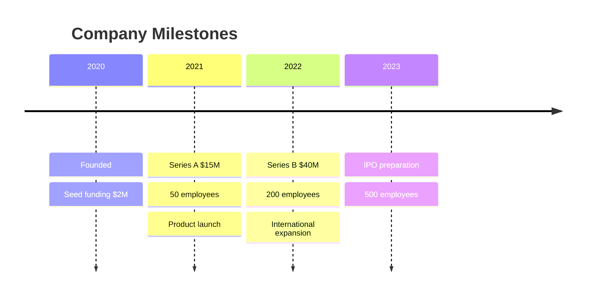
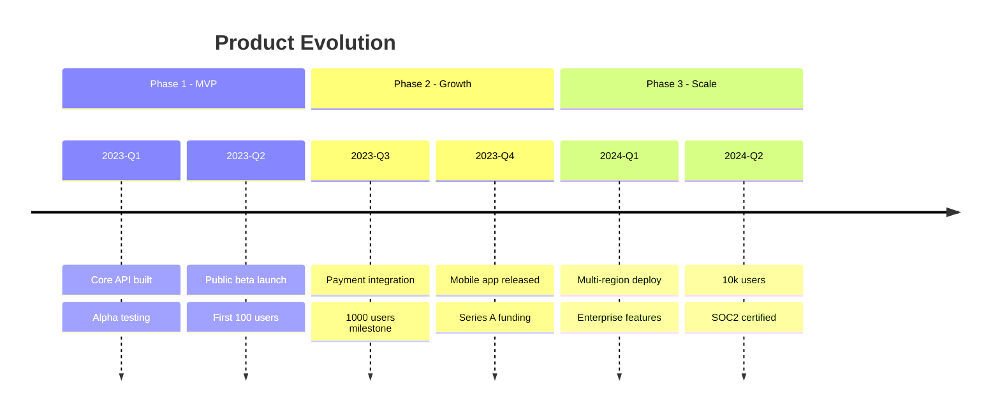
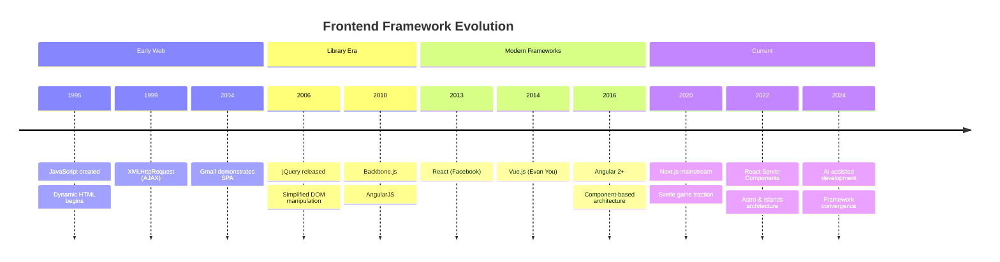

# Timeline

Use for chronological events, release history, project milestones, and historical sequences.

## Basic Example



## Syntax

```
timeline
    title [Title text]
    [Time period] : [Event 1]
                  : [Event 2]
                  : [Event 3]
```

- Each time period can have multiple events (one per `: ` line)
- Time periods are displayed in order on the axis

## Sections



## Advanced Example: Technology Adoption



## Best Practices

1. **Clear time labels** — use consistent format (dates, quarters, years)
2. **Concise events** — 3-8 words per event
3. **Use sections** — group by era, phase, or theme
4. **Limit events per period** — max 3-4 per time point
5. **Chronological order** — always earliest to latest (top to bottom)
6. **Highlight key moments** — fewer, more impactful events > exhaustive list
